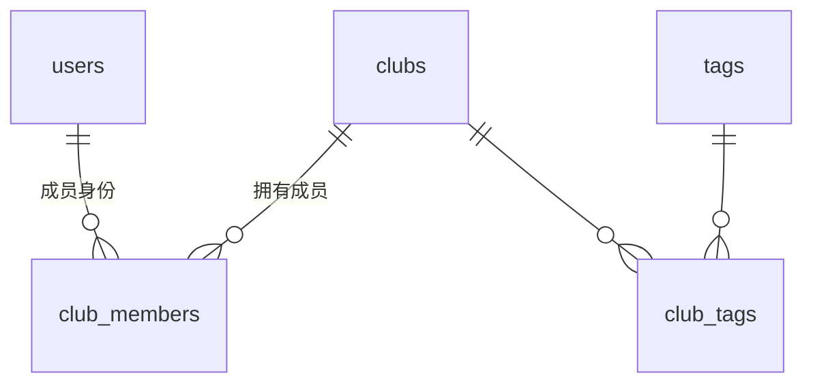
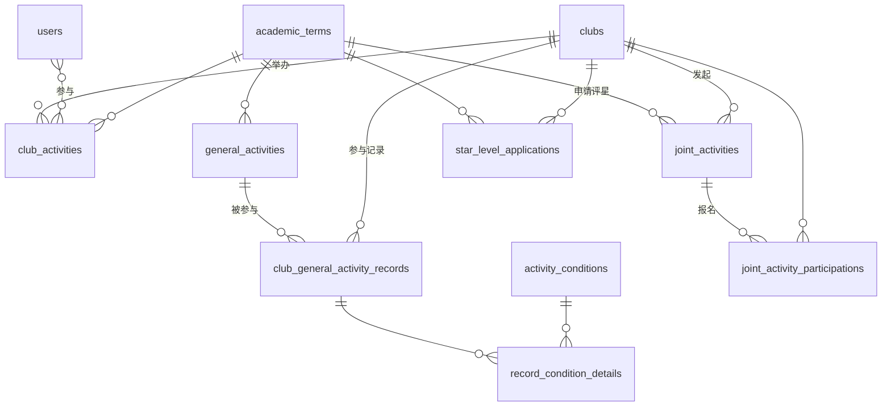
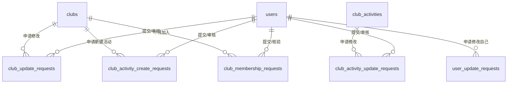

# BNDSphere 数据库架构文档

> **ORM 框架**：SQLAlchemy 2.x（异步模式，驱动 `psycopg` v3）
> **数据库引擎**：PostgreSQL（唯一支持的引擎；`club.name/summary/description` 上的全文检索索引依赖 `pg_trgm` 扩展，不兼容其他数据库）
> **Schema**：所有表都建在 Postgres 的 `app` schema 下（见 [`core/database.py`](../../backend/app/core/database.py) 中 `Base.metadata = MetaData(..., schema="app")`），而不是默认的 `public`
> **源代码目录**：`backend/app/models/`（含 `moderations/`、`verifications/` 两个子包）
>
> 本文档随 `backend/app/models/` 源码整理，如有出入以源码为准；字段级别的长度/取值范围校验大多在 `backend/app/schemas/` 的 Pydantic 模型里，而不是数据库列约束本身（多数字符串列是不限长度的 `Text`）。

---

## 目录

- [1. 概述](#1-概述)
- [2. 基础设施](#2-基础设施)
  - [2.1 Base 基类](#21-base-基类)
  - [2.2 命名约定](#22-命名约定)
  - [2.3 Mixin 混入类](#23-mixin-混入类)
- [3. 数据表定义](#3-数据表定义)
  - [3.1 users — 用户表](#31-users--用户表)
  - [3.2 clubs — 社团表](#32-clubs--社团表)
  - [3.3 club_members — 社团成员表](#33-club_members--社团成员表)
  - [3.4 tags — 标签表](#34-tags--标签表)
  - [3.5 club_tags — 社团-标签关联表](#35-club_tags--社团-标签关联表)
  - [3.6 academic_terms — 学期表](#36-academic_terms--学期表)
  - [3.7 club_activities — 社团活动表](#37-club_activities--社团活动表)
  - [3.8 club_activity_participants — 活动参与者关联表](#38-club_activity_participants--活动参与者关联表)
  - [3.9 announcements — 公告表](#39-announcements--公告表)
  - [3.10 general_activities — 通用活动表](#310-general_activities--通用活动表)
  - [3.11 club_general_activity_records — 社团通用活动记录表](#311-club_general_activity_records--社团通用活动记录表)
  - [3.12 activity_conditions / record_condition_details](#312-activity_conditions--record_condition_details)
  - [3.13 star_level_applications — 星级评定申请表](#313-star_level_applications--星级评定申请表)
  - [3.14 joint_activities / joint_activity_participations — 联合活动](#314-joint_activities--joint_activity_participations--联合活动)
  - [3.15 moderations.* — 审核（moderation）请求表](#315-moderations--审核moderation请求表)
  - [3.16 verifications.* — 核验（verification）请求表](#316-verifications--核验verification请求表)
- [4. 枚举类型汇总](#4-枚举类型汇总)
- [5. 实体关系图 (ER Diagram)](#5-实体关系图-er-diagram)
  - [5.1 核心：用户 / 社团 / 成员](#51-核心用户--社团--成员)
  - [5.2 活动 / 星级评分](#52-活动--星级评分)
  - [5.3 审核（moderation）/ 核验（verification）](#53-审核moderation-核验verification)

---

## 1. 概述

BNDSphere 的数据库围绕**学校社团管理**这一核心业务设计，涵盖以下领域：

| 领域             | 说明                                                                 |
| ---------------- | -------------------------------------------------------------------- |
| **用户管理**     | 用户注册、角色权限、年级、企业微信集成                               |
| **社团管理**     | 社团创建、审核、归档、分类、标签、成员与职务变更                     |
| **社团活动**     | 社团级活动的创建/更新（走审核）与参与者记录                          |
| **通用活动**     | 校级/大型/社联活动，社团参与记录与积分审核                           |
| **联合活动**     | 跨社团联合活动：发起、报名、初审公开、结项归档、终审打分（社联视角） |
| **星级评定**     | 社团星级评定申请（竞赛加分、独特性声明、成长故事、跨年级影响力）审核 |
| **社团星级评分** | 依据规则实时计算社团综合得分与星级（`StarRatingService`）            |
| **学期管理**     | 学期定义与"当前学期"标记，多数按学期归属的表都挂在当前学期下         |
| **公告**         | 首页/后台公告，支持生效时间窗口                                      |
| **审核 / 核验**  | 见 [`architecture/overview.md`](overview.md) 的"审核 / 核验模式"一节 |
| **文件上传**     | 对象存储（OSS）直传，见 `services/upload_policy.py`（无独立数据表）  |

---

## 2. 基础设施

### 2.1 Base 基类

所有模型继承自 `Base`（`DeclarativeBase` 的子类），自动获得：

| 列名 | 类型  | 说明                    |
| ---- | ----- | ----------------------- |
| `id` | `int` | 主键，自增（`SERIAL`）  |

`Base.metadata` 还固定了 `schema="app"`——数据库连接、迁移都要在 `app` schema 下操作，而不是 `public`。

> 源码位置：`backend/app/core/database.py`

### 2.2 命名约定

项目通过 `MetaData(naming_convention=...)` 统一了所有约束和索引的命名规则：

| 类型      | 模板                                                      | 示例                                  |
| --------- | ----------------------------------------------------------- | -------------------------------------- |
| 索引 (IX) | `ix_%(table_name)s_%(all_cols)s`                             | `ix_users_username`                    |
| 唯一 (UQ) | `uq_%(table_name)s_%(all_cols)s`                             | `uq_users_email`                       |
| 检查 (CK) | `ck_%(table_name)s_%(constraint_name)s`                      | `ck_club_activities_check_start_end_time` |
| 外键 (FK) | `fk_%(table_name)s_%(all_cols)s_%(referred_table_name)s`     | `fk_club_members_user_id_users`        |
| 主键 (PK) | `pk_%(table_name)s`                                          | `pk_users`                             |

命名为 `Index(...)` / `UniqueConstraint(...)` 时显式传入的 `name=` 会原样使用（例如各种 `ix_unique_*`、`ix_single_pending_*`），不受上表模板影响。

### 2.3 Mixin 混入类

#### AcademicTermMixin（`app/models/academic_term.py`）

为需要关联学期的表（`club_activities`、`general_activities`、`star_level_applications`、`joint_activities`）提供：

| 列名               | 类型  | 说明                                                    |
| ------------------ | ----- | ------------------------------------------------------- |
| `academic_term_id` | `int` | 外键 → `academic_terms.id`，默认取 `is_current=True` 的那条 |

同时附带 `academic_term` relationship，使用 `selectin` 加载策略。

#### AuditMixin（`app/models/user.py`）

为"简单审核流"的表（`club_general_activity_records`、`star_level_applications`）提供：

| 列名           | 类型              | 说明                    |
| -------------- | ----------------- | ----------------------- |
| `audit_status` | `AuditStatusEnum` | 审核状态，默认 `pending` |
| `auditor_id`   | `int \| None`     | 外键 → `users.id`，审核人 |

同时附带 `auditor` relationship 指向 `User`。这些表本身就是待审核的记录，没有独立的"申请表"。

#### ModerationMixin / RequestorMixin（`app/models/moderations/moderation_common.py`）

为"先建申请表、审核通过后再写回目标表"的**审核（moderation）**流程提供（详见 [overview.md](overview.md)）：

`ModerationMixin`：

| 列名                | 类型                     | 说明                              |
| ------------------- | ------------------------ | --------------------------------- |
| `moderation_status` | `ModerationStatusEnum`   | `pending / approved / rejected / superseded`，默认 `pending` |
| `moderator_id`      | `int \| None`            | 外键 → `users.id`                 |
| `moderate_at`       | `DateTime \| None`       | 审核时间                          |

`RequestorMixin`：

| 列名           | 类型            | 说明                          |
| -------------- | --------------- | ----------------------------- |
| `requestor_id` | `int`           | 外键 → `users.id`，申请人      |
| `request_at`   | `DateTime`      | `server_default=now()`        |

#### VerificationMixin / ApplicantMixin（`app/models/verifications/verification_common.py`）

为"社团/联合活动内部人员核验申请"的**核验（verification）**流程提供：

`VerificationMixin`：

| 列名                 | 类型                      | 说明                                     |
| -------------------- | ------------------------- | ---------------------------------------- |
| `verification_status` | `VerificationStatusEnum` | `pending / approved / rejected`，默认 `pending` |
| `verifier_id`        | `int \| None`             | 外键 → `users.id`                        |
| `verify_at`          | `DateTime \| None`        | 核验时间                                 |

`ApplicantMixin`：

| 列名           | 类型       | 说明                     |
| -------------- | ---------- | ------------------------ |
| `applicant_id` | `int`      | 外键 → `users.id`，申请人 |
| `apply_at`     | `DateTime` | `server_default=now()`   |

---

## 3. 数据表定义

### 3.1 `users` — 用户表

> 源码：`app/models/user.py`

| 列名              | 类型                | 约束 / 默认值                 | 说明                          |
| ----------------- | ------------------- | ------------------------------ | ----------------------------- |
| `id`              | `int`               | PK, 自增                       | 主键                           |
| `username`        | `Text`               | UNIQUE, INDEX                  | 用户名                         |
| `email`           | `Text \| None`       | UNIQUE, 默认 `NULL`            | 邮箱                           |
| `hashed_password` | `String(255)`        | NOT NULL                       | 哈希密码（argon2，见 `core/security.py`） |
| `avatar_uri`      | `HttpUrl \| None`    | 默认 `NULL`                    | 头像地址                       |
| `description`     | `Text`               | 默认 `"这位用户还没有设置简介"` | 个人简介                       |
| `real_name`       | `String(20) \| None` | 默认 `NULL`                    | 真实姓名                       |
| `role`            | `RoleEnum`           | 默认 `user`                    | 用户角色                       |
| `wecom_userid`    | `String(64) \| None` | UNIQUE, INDEX, 默认 `NULL`     | 企业微信用户 ID                |
| `grade`           | `UserGradeEnum \| None` | 默认 `NULL`                  | 年级（含国际部年级，用于星级评分的"跨年级影响力"计算） |
| `created_at`      | `DateTime(tz)`       | `server_default=now()`         | 创建时间                       |

**关系 (Relationships)**：

| 关系名                          | 目标模型      | 类型   | 说明                                        |
| ------------------------------- | ------------- | ------ | ------------------------------------------- |
| `club_memberships`              | `ClubMember`  | 一对多 | 用户的社团成员记录                          |
| `participated_club_activities`  | `ClubActivity`| 多对多 | 通过 `club_activity_participants` 关联       |

---

### 3.2 `clubs` — 社团表

> 源码：`app/models/club.py`

| 列名          | 类型                | 约束 / 默认值           | 说明          |
| ------------- | ------------------- | ------------------------ | ------------- |
| `id`          | `int`                | PK, 自增                 | 主键          |
| `name`        | `String(128)`        | INDEX                    | 社团名称      |
| `summary`     | `Text`                | NOT NULL                 | 社团简介      |
| `description` | `Text`                | NOT NULL                 | 社团详细描述  |
| `logo_uri`    | `HttpUrl \| None`     | 默认 `NULL`               | Logo 地址     |
| `created_at`  | `DateTime(tz)`        | `server_default=now()`   | 创建时间      |
| `status`      | `ClubStatusEnum`      | 默认 `unreviewed`         | 社团状态      |
| `star_level`  | `ClubStarLevelEnum`   | 默认 `none`               | 星级等级（星级评定申请通过后写回） |
| `category`    | `ClubCategoryEnum`    | NOT NULL                 | 社团分类      |

**关系 (Relationships)**：

| 关系名                            | 目标模型                    | 类型   | 加载策略   |
| --------------------------------- | --------------------------- | ------ | ---------- |
| `members`                         | `ClubMember`                 | 一对多 | `selectin` |
| `tags`                             | `Tag`                        | 多对多 | 默认       |
| `club_activities`                  | `ClubActivity`                | 一对多 | `selectin` |
| `general_activity_records`         | `ClubGeneralActivityRecord`   | 一对多，`cascade="all, delete-orphan"` | `selectin` |
| `initiated_joint_activities`       | `JointActivity`                | 一对多，`cascade="all, delete-orphan"` | `select`   |
| `joint_activity_participations`    | `JointActivityParticipation`   | 一对多，`cascade="all, delete-orphan"` | `select`   |

**索引与约束**：

| 名称                          | 类型         | 说明                                                                |
| ----------------------------- | ------------ | -------------------------------------------------------------------- |
| `ix_unique_active_club_name`  | 条件唯一索引 | 仅对 `status != archived` 的社团，`name` 唯一（允许归档社团重名）    |
| `ix_clubs_name_trgm`          | GIN (`gin_trgm_ops`) | 支撑 `name` 的模糊搜索（需要 `pg_trgm` 扩展）                 |
| `ix_clubs_summary_trgm`       | GIN (`gin_trgm_ops`) | 同上，作用于 `summary` 列                                     |
| `ix_clubs_description_trgm`   | GIN (`gin_trgm_ops`) | 同上，作用于 `description` 列                                 |

---

### 3.3 `club_members` — 社团成员表

> 源码：`app/models/clubmember.py`

| 列名         | 类型                  | 约束 / 默认值                              | 说明          |
| ------------ | ---------------------- | -------------------------------------------- | ------------- |
| `id`         | `int`                  | PK, 自增                                     | 主键          |
| `user_id`    | `int`                  | FK → `users.id`                              | 用户外键      |
| `club_id`    | `int`                  | FK → `clubs.id`                              | 社团外键      |
| `membership` | `ClubMembershipEnum`    | NOT NULL                                     | 成员角色      |
| `updated_at` | `DateTime(tz)`          | `server_default=now()`, `onupdate=now()`      | 最后更新时间  |

**约束**：`uix_club_id_user_id` — `(club_id, user_id)` 联合唯一约束。

**关系**：`user` → `User`（`selectin`），`club` → `Club`（双向）。

> 退出社团 / 被移出社团都是把 `membership` 置为 `left`（软删除），不会删除这一行——`uix_club_id_user_id` 的唯一约束因此也保证了同一用户不会在同一社团留下两条"当前有效"的成员记录（重新申请加入时复用/更新同一行）。

---

### 3.4 `tags` — 标签表

> 源码：`app/models/tag.py`

| 列名     | 类型             | 约束 / 默认值 | 说明     |
| -------- | ----------------- | -------------- | -------- |
| `id`     | `int`               | PK, 自增       | 主键     |
| `name`   | `String(50)`        | UNIQUE, INDEX  | 标签名称 |
| `status` | `TagStatusEnum`     | 默认 `normal`  | 标签状态 |

**关系**：`clubs` → `Club`（多对多，通过 `club_tags` 关联）

---

### 3.5 `club_tags` — 社团-标签关联表

> 源码：`app/models/clubtag.py`

纯关联表，`Table()` 声明，无独立 ORM 模型类，复合主键 `(club_id, tag_id)`，两列均为外键（`club_id → clubs.id`，`tag_id → tags.id`）。

---

### 3.6 `academic_terms` — 学期表

> 源码：`app/models/academic_term.py`

| 列名         | 类型          | 约束 / 默认值 | 说明                          |
| ------------ | -------------- | -------------- | ----------------------------- |
| `id`         | `int`           | PK, 自增       | 主键                          |
| `term_name`  | `String(50)`    | UNIQUE         | 学期名称，如 `2025 - 2026 - 1` |
| `start_date` | `Date`          | NOT NULL       | 学期开始日期                  |
| `end_date`   | `Date`          | NOT NULL       | 学期结束日期                  |
| `is_current` | `Boolean`       | 默认 `False`   | 是否为当前学期                |

**特殊索引**：`ix_only_one_current` — 条件唯一索引，保证最多只有一条记录 `is_current=True`。

**ORM 事件**：

- **`before_insert`**：若 `term_name` 为空，据 `start_date` 自动计算：9 月开始 → `"{year} - {year+1} - 1"`；否则 → `"{year-1} - {year} - 2"`。
- **`before_update`**：若修改了 `start_date` 但未手动修改 `term_name`，自动重新计算。

> 应用层（`AcademicTermService.set_current` / `create`）保证"设为当前学期"时先清空其它学期的 `is_current`，与 `ix_only_one_current` 索引形成双重保障。

---

### 3.7 `club_activities` — 社团活动表

> 源码：`app/models/club_activity.py`（继承 `AcademicTermMixin`）

| 列名                | 类型            | 约束 / 默认值 | 说明                     |
| ------------------- | ---------------- | -------------- | ------------------------ |
| `id`                | `int`             | PK, 自增       | 主键                     |
| `name`              | `String(64)`      | INDEX          | 活动名称                 |
| `description`       | `Text`             | NOT NULL       | 活动描述                 |
| `club_id`           | `int`              | FK → `clubs.id`| 所属社团                 |
| `start_time`        | `DateTime(tz)`     | NOT NULL       | 开始时间                 |
| `end_time`          | `DateTime(tz)`     | NOT NULL       | 结束时间                 |
| `location`          | `Text`             | NOT NULL       | 活动地点                 |
| `picture_urls`      | `JSON`             | 默认 `[]`      | 活动图片 URL 列表        |
| `academic_term_id`  | `int`              | FK → `academic_terms.id` | 来自 `AcademicTermMixin` |

**约束**：`check_start_end_time` — `end_time > start_time`。

**关系**：`club` → `Club`；`participants` → `User`（多对多，经 `club_activity_participants`）；`academic_term` → `AcademicTerm`（来自 Mixin）。

> 社团活动本身没有直接的增/改接口——创建和更新都要经过 `club_activity_create_requests` / `club_activity_update_requests` 的审核流程，详见 [3.15](#315-moderations--审核moderation请求表)。

---

### 3.8 `club_activity_participants` — 活动参与者关联表

> 源码：`app/models/club_activity_participant.py`

纯关联表，复合主键 `(user_id, club_activity_id)`，`user_id → users.id`，`club_activity_id → club_activities.id`。

---

### 3.9 `announcements` — 公告表

> 源码：`app/models/announcement.py`

| 列名         | 类型              | 约束 / 默认值           | 说明                                  |
| ------------ | ------------------ | ------------------------ | ------------------------------------- |
| `id`         | `int`               | PK, 自增                 | 主键                                  |
| `title`      | `String(120)`       | INDEX                    | 标题                                  |
| `body`       | `Text`               | NOT NULL                 | 正文                                  |
| `link_url`   | `Text \| None`       | 默认 `NULL`               | 跳转链接                              |
| `starts_at`  | `DateTime(tz) \| None` | INDEX, 默认 `NULL`      | 生效开始时间（为空表示立即生效）      |
| `ends_at`    | `DateTime(tz) \| None` | INDEX, 默认 `NULL`      | 生效结束时间（为空表示不过期）        |
| `is_active`  | `Boolean`            | INDEX, 默认 `True`       | 是否启用                              |
| `created_at` | `DateTime(tz)`       | `server_default=now()`   | 创建时间                              |

无独立审核流程；面向公众的 `GET /announcements` 只返回 `is_active=True` 且当前时间落在 `[starts_at, ends_at]`（缺省侧不限制）区间内的公告，管理端 `GET /admin/announcements` 可看到全部。

---

### 3.10 `general_activities` — 通用活动表

> 源码：`app/models/general_activity.py`（继承 `AcademicTermMixin`）

| 列名                | 类型                       | 约束 / 默认值           | 说明                       |
| ------------------- | --------------------------- | ------------------------ | -------------------------- |
| `id`                | `int`                        | PK, 自增                 | 主键                       |
| `name`              | `String(128)`                | INDEX                    | 活动名称                   |
| `description`       | `Text`                        | NOT NULL                 | 活动描述                   |
| `level`             | `GeneralActivityLevelEnum`    | NOT NULL                 | 活动级别                   |
| `starts_at`         | `DateTime(tz) \| None`        | INDEX, 默认 `NULL`       | 开始时间                   |
| `ends_at`           | `DateTime(tz) \| None`        | INDEX, 默认 `NULL`       | 结束时间                   |
| `poster_uri`        | `Text \| None`                | 默认 `NULL`               | 海报图片地址                |
| `article_url`       | `Text \| None`                | 默认 `NULL`               | 相关文章/报道链接           |
| `created_at`        | `DateTime(tz)`                | `server_default=now()`   | 创建时间                   |
| `academic_term_id`  | `int`                         | FK → `academic_terms.id` | 来自 `AcademicTermMixin`   |

**关系**：`club_records` → `ClubGeneralActivityRecord`（一对多，`cascade="all, delete-orphan"`，`selectin`）。

由社联（`club_federation` 路由 / `federation_staff`、`admin`、`dev` 角色）创建和维护，`admin` 也可通过 `/admin/general-activities` 管理。

---

### 3.11 `club_general_activity_records` — 社团通用活动记录表

> 源码：`app/models/general_activity.py`（继承 `AuditMixin`）

| 列名                  | 类型                        | 约束 / 默认值                                      | 说明              |
| --------------------- | ---------------------------- | ---------------------------------------------------- | ----------------- |
| `id`                  | `int`                         | PK, 自增                                             | 主键              |
| `club_id`             | `int`                         | FK → `clubs.id` (`CASCADE`), INDEX                   | 社团外键          |
| `activity_id`         | `int`                         | FK → `general_activities.id` (`CASCADE`), INDEX      | 活动外键          |
| `participation_type`  | `ParticipationTypeEnum`        | NOT NULL                                             | 参与类型          |
| `requested_score`     | `int`                          | 默认 `0`                                             | 申请分数          |
| `final_score`         | `int`                          | 默认 `0`                                             | 最终分数          |
| `proof_files`         | `JSON`                         | 默认 `[]`                                            | 证明文件 URL 列表 |
| `created_at`          | `DateTime(tz)`                 | `server_default=now()`                               | 创建时间          |
| `audit_status`        | `AuditStatusEnum`               | 默认 `pending`                                       | 来自 `AuditMixin` |
| `auditor_id`          | `int \| None`                   | FK → `users.id`                                      | 来自 `AuditMixin` |

**约束**：`ix_unique_club_activity_record` — `(club_id, activity_id)` 联合唯一（一个社团对同一个通用活动只能有一条记录）。

**关系**：`club` → `Club`；`activity` → `GeneralActivity`；`auditor` → `User`（来自 `AuditMixin`）；`met_conditions` → `RecordConditionDetail`（一对多，`cascade="all, delete-orphan"`，`selectin`）。

`final_score`（审核通过后的分数）会计入 [星级评分](overview.md) 的"活动参与"部分。

---

### 3.12 `activity_conditions` / `record_condition_details`

> 源码：`app/models/general_activity.py`

`activity_conditions`（评分条件字典表）：

| 列名          | 类型      | 约束 / 默认值 | 说明     |
| ------------- | ---------- | -------------- | -------- |
| `id`          | `int`       | PK, 自增       | 主键     |
| `description` | `Text`      | NOT NULL       | 条件描述 |
| `active`      | `Boolean`   | NOT NULL       | 是否启用 |

`record_condition_details`（记录 × 条件的满足情况）：

| 列名           | 类型      | 约束 / 默认值                                             | 说明     |
| -------------- | ---------- | ------------------------------------------------------------ | -------- |
| `id`           | `int`       | PK, 自增                                                     | 主键     |
| `record_id`    | `int`       | FK → `club_general_activity_records.id` (`CASCADE`), INDEX   | 记录外键 |
| `condition_id` | `int`       | FK → `activity_conditions.id` (`RESTRICT`), INDEX             | 条件外键 |
| `is_met`       | `Boolean`   | NOT NULL                                                     | 是否满足 |

**关系**：`record` → `ClubGeneralActivityRecord`；`condition` → `ActivityCondition`。

> 这两张表在当前 API 层（`app/api/v1/`）没有对应的路由，模型已就位但尚未接入业务流程。

---

### 3.13 `star_level_applications` — 星级评定申请表

> 源码：`app/models/star_level.py`（继承 `AcademicTermMixin`、`AuditMixin`）

| 列名                        | 类型                          | 约束 / 默认值           | 说明                                       |
| --------------------------- | ------------------------------ | ------------------------ | ------------------------------------------ |
| `id`                        | `int`                            | PK, 自增                 | 主键                                       |
| `club_id`                   | `int`                            | FK → `clubs.id`           | 社团外键                                   |
| `contest_attachment`        | `HttpUrl \| None`                | 默认 `NULL`               | 竞赛附件链接（走 `uploads` 直传）           |
| `requested_contest_score`   | `int \| None`                    | 默认 `NULL`               | 申请人自报的竞赛分数                       |
| `final_contest_score`       | `int \| None`                    | 默认 `NULL`               | 审核确认的竞赛分数（计入总分，见 overview.md） |
| `uniqueness_statement`      | `Text \| None`                   | 默认 `NULL`               | 独特性声明文本                             |
| `uniqueness_approved`       | `Boolean \| None`                | 默认 `NULL`               | 独特性是否通过                             |
| `growth_story_url`          | `HttpUrl \| None`                | 默认 `NULL`               | 成长故事材料链接                           |
| `growth_story_approved`     | `Boolean \| None`                | 默认 `NULL`               | 成长故事是否通过（通过则 +5 分）            |
| `target_grade_1`            | `UserGradeEnum \| None`          | 默认 `NULL`               | 跨年级影响力目标级部之一                    |
| `target_grade_2`            | `UserGradeEnum \| None`          | 默认 `NULL`               | 跨年级影响力目标级部之二                    |
| `approved_score`            | `int \| None`                    | 默认 `NULL`               | 审核通过后计算出的总分                     |
| `approved_level`            | `ClubStarLevelEnum \| None`      | 默认 `NULL`               | 审核通过后判定的星级                       |
| `created_at`                | `DateTime(tz)`                   | `server_default=now()`   | 创建时间                                   |
| `academic_term_id`          | `int`                             | FK → `academic_terms.id` | 来自 `AcademicTermMixin`                    |
| `audit_status`              | `AuditStatusEnum`                 | 默认 `pending`            | 来自 `AuditMixin`                          |
| `auditor_id`                | `int \| None`                     | FK → `users.id`           | 来自 `AuditMixin`                          |

**约束**：`uq_star_level_applications_club_id_academic_term_id` — `(club_id, academic_term_id)` 联合唯一，每学期每社团仅一次申请。

**关系**：`club` → `Club`；`auditor` → `User`（来自 `AuditMixin`）；`academic_term` → `AcademicTerm`（来自 `AcademicTermMixin`）。

审核通过（`audit_status=approved`）时，`StarLevelService.review` 会用 `StarRatingService` 重新计算总分/星级并写回 `approved_score`/`approved_level`，同时把 `clubs.star_level` 更新为新星级——完整评分规则见 [architecture/overview.md](overview.md)。

---

### 3.14 `joint_activities` / `joint_activity_participations` — 联合活动

> 源码：`app/models/joint_activity.py`（`JointActivity` 继承 `AcademicTermMixin`）

`joint_activities`：

| 列名                      | 类型                              | 约束 / 默认值             | 说明                                             |
| ------------------------- | ---------------------------------- | -------------------------- | ------------------------------------------------ |
| `id`                      | `int`                                | PK, 自增                   | 主键                                             |
| `name`                    | `String(128)`                       | INDEX                      | 活动名称                                         |
| `description`             | `Text`                               | NOT NULL                   | 活动描述                                         |
| `location`                | `String(200)`                       |                             | 活动地点                                         |
| `starts_at` / `ends_at`   | `DateTime(tz)`                      | INDEX                       | 开始 / 结束时间                                  |
| `initiator_club_id`       | `int`                                 | FK → `clubs.id` (`CASCADE`), INDEX | 发起社团                                  |
| `created_by_user_id`      | `int`                                 | FK → `users.id`, INDEX      | 创建人                                            |
| `preliminary_status`      | `ModerationStatusEnum`                | 默认 `pending`, INDEX       | 初审状态（社联审核是否可公开报名）                |
| `preliminary_auditor_id`  | `int \| None`                         | FK → `users.id`             | 初审人                                            |
| `preliminary_reviewed_at` | `DateTime(tz) \| None`                |                             | 初审时间                                          |
| `archive_text`            | `Text \| None`                        | 默认 `NULL`                 | 结项文字记录                                     |
| `archive_files`           | `JSON`                                 | 默认 `[]`                   | 结项材料 URL 列表                                |
| `final_status`            | `VerificationStatusEnum \| None`      | 默认 `NULL`, INDEX          | 终审（结项）状态                                 |
| `final_score`             | `int`                                  | 默认 `0`                    | 终审得分（`6~8` 分，见 `constants.JOINT_ACTIVITY_{MIN,MAX}_FINAL_SCORE`） |
| `final_submitted_at`      | `DateTime(tz) \| None`                |                             | 提交终审的时间                                   |
| `final_auditor_id`        | `int \| None`                         | FK → `users.id`             | 终审人                                            |
| `final_reviewed_at`       | `DateTime(tz) \| None`                |                             | 终审时间                                          |
| `created_at` / `updated_at` | `DateTime(tz)`                      | `server_default=now()`, `onupdate=now()`（仅 `updated_at`） | 创建 / 更新时间     |
| `academic_term_id`        | `int`                                  | FK → `academic_terms.id`    | 来自 `AcademicTermMixin`                          |

`preliminary_status` 复用了 moderation 的 `ModerationStatusEnum`，`final_status` 复用了 verification 的 `VerificationStatusEnum`，但 `joint_activities` 本身**不是**独立的 moderation/verification 请求表——这两个状态列直接长在活动记录上，是"简单审核流"的又一种变体（类似 `AuditMixin`，但字段是手写的，不是继承来的）。

`joint_activity_participations`：

| 列名                    | 类型      | 约束 / 默认值                                | 说明             |
| ----------------------- | ---------- | ----------------------------------------------- | ---------------- |
| `id`                    | `int`       | PK, 自增                                         | 主键             |
| `activity_id`           | `int`       | FK → `joint_activities.id` (`CASCADE`), INDEX    | 联合活动外键     |
| `club_id`               | `int`       | FK → `clubs.id` (`CASCADE`), INDEX               | 参与社团外键     |
| `registered_by_user_id` | `int`       | FK → `users.id`, INDEX                           | 报名操作人       |
| `is_initiator`          | `Boolean`   | 默认 `False`                                     | 是否为发起社团本身的报名记录 |
| `created_at`            | `DateTime(tz)` | `server_default=now()`                        | 报名时间         |

**约束**：`ix_unique_joint_activity_club_participation` — `(activity_id, club_id)` 联合唯一（一个社团对同一活动只能报名一次）。

**关系**：`activity` → `JointActivity`（`participations` 按 `created_at` 排序，`selectin`）；`club` → `Club`；`registered_by` → `User`。

---

### 3.15 `moderations.*` — 审核（moderation）请求表

> 源码：`app/models/moderations/`；均混入 `ModerationMixin` + `RequestorMixin`（见 [2.3](#23-mixin-混入类)）

**`club_update_requests`**（`app/models/moderations/club.py`）：`club_id`（FK → `clubs.id`, `CASCADE`）、`summary`/`description`/`logo_uri`（均可空，只填要改的字段）、`update_fields`（`JSON`，记录本次实际请求修改的字段名列表，用于审核通过时局部更新目标记录）。条件唯一索引 `ix_single_pending_club_update_request`：同一 `club_id` 至多一条 `moderation_status=pending` 的请求（新请求会先把旧的 pending 请求置为 `superseded`）。

**`club_activity_create_requests`**（`app/models/moderations/club_activity.py`）：`club_id`、`name`/`description`/`start_time`/`end_time`/`location`（新建活动的完整字段，均必填），`CheckConstraint check_start_end_time`。

**`club_activity_update_requests`**（同文件）：`club_activity_id`（FK → `club_activities.id`, `CASCADE`）、同上字段全部可空 + `picture_urls` + `update_fields`；`CheckConstraint check_start_end_time`（允许两端都为空，但若都提供则必须 `end_time > start_time`）；条件唯一索引 `ix_single_pending_club_activity_update_request`（同一活动至多一条 pending 请求）。

**`user_update_requests`**（`app/models/moderations/user_update_request.py`，只混入 `ModerationMixin`，`request_at` 自己声明而非来自 `RequestorMixin`——申请人固定就是 `user_id` 本人）：`user_id`（FK → `users.id`, `CASCADE`）、`username`/`avatar_uri`/`description`/`grade`（可空）+ `update_fields`。条件唯一索引 `ix_single_pending_user_update_request`（同一用户至多一条 pending 请求）。

**审核结果的应用**：以上四张表本身**不直接**修改 `clubs`/`club_activities`/`users`——审核通过时，服务层用 `services/moderation_payload.py` 的 `build_update_payload()` 把请求表里"被请求修改"的字段（由 `update_fields` 或"非空字段"推断）拼成对应的 Update Schema，再调用目标表的仓储层去更新，审核记录本身只落 `moderation_status`/`moderator_id`/`moderate_at`。

---

### 3.16 `verifications.*` — 核验（verification）请求表

> 源码：`app/models/verifications/`；均混入 `VerificationMixin` + `ApplicantMixin`（见 [2.3](#23-mixin-混入类)）

**`club_membership_requests`**（`app/models/verifications/club_membership.py`）：`club_id`（FK → `clubs.id`, `CASCADE`）、`message`（申请留言，`Text` NOT NULL）。条件唯一索引 `ix_single_pending_club_membership_request`：`(club_id, applicant_id)` 至多一条 pending 请求。核验通过后由 `ClubMembershipRequestService` 直接把申请人写入 `club_members`（`membership=member`），不经过审核请求表的字段拼装（这类请求本身没有"要改的字段"，只有通过/拒绝）。

---

## 4. 枚举类型汇总

| 枚举类型                     | 定义位置                                          | 可选值                                                                                     | 说明             |
| ---------------------------- | -------------------------------------------------- | ------------------------------------------------------------------------------------------ | ---------------- |
| `RoleEnum`                   | `user.py`                                           | `ban`, `user`, `moderator`, `federation_staff`, `admin`, `dev`                              | 全局用户角色（`dev` 对所有基于角色/社团职务的检查免检，见 `services/policies.py`） |
| `UserGradeEnum`               | `user.py`                                           | `grade_7`…`grade_12`, `inter_grade_9`…`inter_grade_12`                                       | 年级；`grade_level` 属性把国际部年级映射到对应的常规年级数字（7~12），用于跨年级统计 |
| `AuditStatusEnum`             | `user.py`                                           | `pending`, `approved`, `rejected`                                                          | "简单审核流"状态 |
| `ClubStatusEnum`               | `club.py`                                          | `unreviewed`, `normal`, `archived`                                                          | 社团状态         |
| `ClubStarLevelEnum`            | `club.py`                                          | `none`, `one_star`, `two_star`, `three_star`, `four_star`, `five_star`, `honorary`          | 社团星级         |
| `ClubCategoryEnum`             | `club.py`                                          | `sports`, `humanity`, `arts`, `science`, `charity`, `business`, `campus`, `other`           | 社团分类         |
| `ClubMembershipEnum`           | `clubmember.py`                                     | `pending`, `member`, `president`, `vice_president`, `left`                                  | 社团成员角色（`pending` 目前未被写入路径实际使用，加入靠 `club_membership_requests`；见下方说明） |
| `TagStatusEnum`                | `tag.py`                                            | `normal`, `archived`                                                                        | 标签状态         |
| `GeneralActivityLevelEnum`     | `general_activity.py`                               | `school`, `large`, `club_federation`                                                        | 通用活动级别     |
| `ParticipationTypeEnum`        | `general_activity.py`                               | `participate_only`, `organize`                                                              | 参与类型         |
| `ModerationStatusEnum`         | `moderations/moderation_common.py`                   | `pending`, `approved`, `rejected`, `superseded`                                             | 审核状态；`superseded` = 被同一目标上更晚的新请求取代 |
| `VerificationStatusEnum`       | `verifications/verification_common.py`               | `pending`, `approved`, `rejected`                                                            | 核验状态         |

> 所有枚举均继承自 `StrEnum`，在数据库中存储为字符串值。
>
> `ClubMembershipEnum.pending` 定义在枚举里，但社团加入走的是独立的 `club_membership_requests` 表（`VerificationStatusEnum`），不会把 `club_members.membership` 置为 `pending`；这个枚举值目前是历史遗留，读代码/写迁移时不要假设它会出现在 `club_members` 表里。

---

## 5. 实体关系图 (ER Diagram)

字段级定义都已经在第 3 节的表格里；这里的图只画**表与表之间的关系**（外键基数），故意不重复列属性，按领域拆成三张小图，避免一张图挤下全部 21 张表反而看不清。三张图合起来才是完整关系；跨图共享的表（`users`/`clubs`/`club_activities`）在每张图里都只承担该图关心的那部分关系。

### 5.1 核心：用户 / 社团 / 成员

### 5.2 活动 / 星级评分

`users` 还分别是 `club_general_activity_records`/`star_level_applications`/`joint_activities` 的审核人（`auditor_id`/`preliminary_auditor_id`/`final_auditor_id`），图中略去这几条"谁审核了谁"的边以保持简洁，字段本身在第 3 节列出。

### 5.3 审核（moderation）/ 核验（verification）

下图画的是真实外键（目标表 → 申请表，例如 `club_update_requests.club_id` 指向 `clubs.id`）；"审核通过后把申请里的字段写回目标表"是应用层的数据流，不是外键，图上不体现——流程见 [overview.md](overview.md#审核--核验模式moderation--verification)。申请表与 `users` 的关系表示申请人/审核人，字段见第 3 节。

