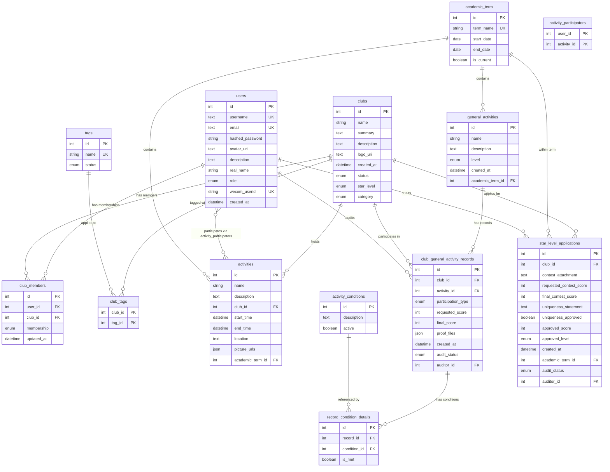

# BNDSphere 数据库架构文档

> **ORM 框架**：SQLAlchemy 2.x（异步模式）
> **数据库引擎**：支持 PostgreSQL / MySQL（索引策略分别适配）
> **源代码目录**：`backend/app/models/`

---

## 目录

- [1. 概述](#1-概述)
- [2. 基础设施](#2-基础设施)
  - [2.1 Base 基类](#21-base-基类)
  - [2.2 命名约定](#22-命名约定)
  - [2.3 Mixin 混入类](#23-mixin-混入类)
- [3. 数据表定义](#3-数据表定义)
  - [3.1 users — 用户表](#31-users--用户表)
  - [3.2 clubs — 社团表](#32-clubs--社团表)
  - [3.3 club_members — 社团成员表](#33-club_members--社团成员表)
  - [3.4 tags — 标签表](#34-tags--标签表)
  - [3.5 club_tags — 社团-标签关联表](#35-club_tags--社团-标签关联表)
  - [3.6 academic_term — 学期表](#36-academic_term--学期表)
  - [3.7 activities — 社团活动表](#37-activities--社团活动表)
  - [3.8 activity_participators — 活动参与者关联表](#38-activity_participators--活动参与者关联表)
  - [3.9 general_activities — 通用活动表](#39-general_activities--通用活动表)
  - [3.10 club_general_activity_records — 社团通用活动记录表](#310-club_general_activity_records--社团通用活动记录表)
  - [3.11 activity_conditions — 活动条件表](#311-activity_conditions--活动条件表)
  - [3.12 record_condition_details — 记录条件明细表](#312-record_condition_details--记录条件明细表)
  - [3.13 star_level_applications — 星级评定申请表](#313-star_level_applications--星级评定申请表)
- [4. 枚举类型汇总](#4-枚举类型汇总)
- [5. 实体关系图 (ER Diagram)](#5-实体关系图-er-diagram)
- [6. N-1 兼容性策略](#6-n-1-兼容性策略)

---

## 1. 概述

BNDSphere 的数据库围绕**学校社团管理**这一核心业务设计，涵盖以下领域：

| 领域         | 说明                                         |
| ------------ | -------------------------------------------- |
| **用户管理** | 用户注册、角色权限、企业微信集成             |
| **社团管理** | 社团创建、审核、归档、分类、标签             |
| **成员管理** | 社团成员的加入、角色分配、退出               |
| **活动管理** | 社团级活动的创建与参与者记录                 |
| **通用活动** | 校级/大型活动记录、社团参与评分与审核        |
| **星级评定** | 社团星级评定申请、竞赛附件、独特性声明与审核 |
| **学期管理** | 学期定义与"当前学期"标记                     |

---

## 2. 基础设施

### 2.1 Base 基类

所有模型继承自 `Base`（`DeclarativeBase` 的子类），自动获得：

| 列名 | 类型  | 说明                 |
| ---- | ----- | -------------------- |
| `id` | `int` | 主键，自增（`SERIAL`）|

> 源码位置：[database.py](file:///e:/projects/bndsphere/backend/app/core/database.py#L47-L49)

### 2.2 命名约定

项目通过 `MetaData(naming_convention=...)` 统一了所有约束和索引的命名规则：

| 类型        | 模板                                                 | 示例                                        |
| ----------- | ---------------------------------------------------- | ------------------------------------------- |
| 索引 (IX)   | `ix_%(table_name)s_%(all_cols)s`                     | `ix_users_username`                         |
| 唯一 (UQ)   | `uq_%(table_name)s_%(all_cols)s`                     | `uq_users_email`                            |
| 检查 (CK)   | `ck_%(table_name)s_%(constraint_name)s`              | `ck_activities_check_start_end_time`        |
| 外键 (FK)   | `fk_%(table_name)s_%(all_cols)s_%(referred_table_name)s` | `fk_club_members_user_id_users`         |
| 主键 (PK)   | `pk_%(table_name)s`                                  | `pk_users`                                  |

### 2.3 Mixin 混入类

#### AcademicTermMixin

为需要关联学期的表（如 `activities`、`general_activities`、`star_level_applications`）提供：

| 列名                | 类型  | 说明                                     |
| ------------------- | ----- | ---------------------------------------- |
| `academic_term_id`  | `int` | 外键 → `academic_term.id`，默认取当前学期 |

同时附带 `academic_term` relationship，使用 `selectin` 加载策略。

> 源码位置：[academic_term.py](file:///e:/projects/bndsphere/backend/app/models/academic_term.py#L73-L88)

#### AuditMixin

为需要审核流程的表（如 `club_general_activity_records`、`star_level_applications`）提供：

| 列名           | 类型              | 说明                            |
| -------------- | ----------------- | ------------------------------- |
| `audit_status` | `AuditStatusEnum` | 审核状态，默认 `pending`          |
| `auditor_id`   | `int \| None`     | 外键 → `users.id`，审核人        |

同时附带 `auditor` relationship 指向 `User`。

> 源码位置：[user.py](file:///e:/projects/bndsphere/backend/app/models/user.py#L66-L86)

---

## 3. 数据表定义

### 3.1 `users` — 用户表

> 源码：[user.py](file:///e:/projects/bndsphere/backend/app/models/user.py)

| 列名              | 类型                | 约束 / 默认值                   | 说明             |
| ----------------- | ------------------- | ------------------------------ | ---------------- |
| `id`              | `int`               | PK, 自增                       | 主键             |
| `username`        | `Text`              | UNIQUE, INDEX                  | 用户名           |
| `email`           | `Text \| None`      | UNIQUE, 默认 `NULL`            | 邮箱             |
| `hashed_password` | `String(255)`       | NOT NULL                       | 哈希密码         |
| `avatar_uri`      | `HttpUrl \| None`   | 默认 `NULL`                    | 头像地址         |
| `description`     | `Text`              | 默认 `"这位用户还没有设置简介"`   | 个人简介         |
| `real_name`       | `String(20) \| None`| 默认 `NULL`                    | 真实姓名         |
| `role`            | `RoleEnum`          | 默认 `user`                    | 用户角色         |
| `wecom_userid`    | `String(64) \| None`| UNIQUE, INDEX, 默认 `NULL`     | 企业微信用户 ID  |
| `created_at`      | `DateTime(tz)`      | `server_default=now()`         | 创建时间         |

**关系 (Relationships)**：

| 关系名                      | 目标模型      | 类型          | 说明                              |
| --------------------------- | ------------- | ------------- | --------------------------------- |
| `club_memberships`          | `ClubMember`  | 一对多        | 用户的社团成员记录                |
| `participated_activities`   | `Activity`    | 多对多        | 通过 `activity_participators` 关联 |

---

### 3.2 `clubs` — 社团表

> 源码：[club.py](file:///e:/projects/bndsphere/backend/app/models/club.py)

| 列名          | 类型                  | 约束 / 默认值              | 说明         |
| ------------- | --------------------- | ------------------------- | ------------ |
| `id`          | `int`                 | PK, 自增                  | 主键         |
| `name`        | `String(128)`         | INDEX                     | 社团名称     |
| `summary`     | `Text`                | NOT NULL                  | 社团简介     |
| `description` | `Text`                | NOT NULL                  | 社团详细描述 |
| `logo_uri`    | `HttpUrl \| None`     | 默认 `NULL`               | Logo 地址    |
| `created_at`  | `DateTime(tz)`        | `server_default=now()`    | 创建时间     |
| `status`      | `ClubStatusEnum`      | 默认 `unreviewed`         | 社团状态     |
| `star_level`  | `ClubStarLevelEnum`   | 默认 `none`               | 星级等级     |
| `category`    | `ClubCategoryEnum`    | NOT NULL                  | 社团分类     |

**关系 (Relationships)**：

| 关系名                       | 目标模型                       | 类型   | 加载策略    |
| ---------------------------- | ------------------------------ | ------ | ----------- |
| `members`                    | `ClubMember`                   | 一对多 | `selectin`  |
| `tags`                       | `Tag`                          | 多对多 | 默认        |
| `activities`                 | `Activity`                     | 一对多 | `selectin`  |
| `general_activity_records`   | `ClubGeneralActivityRecord`    | 一对多 | `selectin`  |

**索引与约束**：

| 名称                          | 类型        | 说明                                                                 |
| ----------------------------- | ----------- | -------------------------------------------------------------------- |
| `ix_unique_active_club_name`  | 条件唯一索引 | 仅对 `status != archived` 的社团，`name` 唯一（允许归档社团重名）      |
| `ix_clubs_name_trgm`          | GIN / 全文  | PostgreSQL: `gin_trgm_ops`；MySQL: `FULLTEXT` + `ngram` 解析器       |
| `ix_clubs_summary_trgm`       | GIN / 全文  | 同上，作用于 `summary` 列                                             |
| `ix_clubs_description_trgm`   | GIN / 全文  | 同上，作用于 `description` 列                                         |

---

### 3.3 `club_members` — 社团成员表

> 源码：[clubmember.py](file:///e:/projects/bndsphere/backend/app/models/clubmember.py)

| 列名         | 类型                 | 约束 / 默认值           | 说明           |
| ------------ | -------------------- | ---------------------- | -------------- |
| `id`         | `int`                | PK, 自增               | 主键           |
| `user_id`    | `int`                | FK → `users.id`        | 用户外键       |
| `club_id`    | `int`                | FK → `clubs.id`        | 社团外键       |
| `membership` | `ClubMembershipEnum` | NOT NULL               | 成员角色       |
| `updated_at` | `DateTime(tz)`       | `server_default=now()`, `onupdate=now()` | 最后更新时间 |

**约束**：

| 名称                    | 类型   | 说明                                |
| ----------------------- | ------ | ----------------------------------- |
| `uix_club_id_user_id`   | UNIQUE | `(club_id, user_id)` 联合唯一约束   |

**关系**：`user` → `User`，`club` → `Club`（双向）

---

### 3.4 `tags` — 标签表

> 源码：[tag.py](file:///e:/projects/bndsphere/backend/app/models/tag.py)

| 列名     | 类型            | 约束 / 默认值            | 说明       |
| -------- | --------------- | ----------------------- | ---------- |
| `id`     | `int`           | PK, 自增                | 主键       |
| `name`   | `String(50)`    | UNIQUE, INDEX           | 标签名称   |
| `status` | `TagStatusEnum` | 默认 `normal`           | 标签状态   |

**关系**：`clubs` → `Club`（多对多，通过 `club_tags` 关联）

---

### 3.5 `club_tags` — 社团-标签关联表

> 源码：[clubtag.py](file:///e:/projects/bndsphere/backend/app/models/clubtag.py)

| 列名      | 类型  | 约束               | 说明       |
| --------- | ----- | ------------------ | ---------- |
| `club_id` | `int` | PK, FK → `clubs.id`| 社团外键   |
| `tag_id`  | `int` | PK, FK → `tags.id` | 标签外键   |

> 纯关联表，使用 `Table()` 声明，无独立 ORM 模型类，使用复合主键。

---

### 3.6 `academic_term` — 学期表

> 源码：[academic_term.py](file:///e:/projects/bndsphere/backend/app/models/academic_term.py)

| 列名         | 类型          | 约束 / 默认值   | 说明                     |
| ------------ | ------------- | --------------- | ------------------------ |
| `id`         | `int`         | PK, 自增        | 主键                     |
| `term_name`  | `String(50)`  | UNIQUE          | 学期名称，如 `2025 - 2026 - 1` |
| `start_date` | `Date`        | NOT NULL        | 学期开始日期             |
| `end_date`   | `Date`        | NOT NULL        | 学期结束日期             |
| `is_current` | `Boolean`     | 默认 `False`    | 是否为当前学期           |

**特殊索引**：

| 名称                  | 类型        | 说明                                                      |
| --------------------- | ----------- | --------------------------------------------------------- |
| `ix_only_one_current` | 条件唯一索引 | 保证最多只有一条记录的 `is_current` 为 `True`              |

**ORM 事件**：

- **`before_insert`**：若 `term_name` 为空，根据 `start_date` 自动计算学期名称。
  - 9 月开始 → `"{year} - {year+1} - 1"`
  - 其他月份 → `"{year-1} - {year} - 2"`
- **`before_update`**：若修改了 `start_date` 但未手动修改 `term_name`，自动重新计算。

---

### 3.7 `activities` — 社团活动表

> 源码：[activity.py](file:///e:/projects/bndsphere/backend/app/models/activity.py)

| 列名                | 类型          | 约束 / 默认值           | 说明                   |
| ------------------- | ------------- | ---------------------- | ---------------------- |
| `id`                | `int`         | PK, 自增               | 主键                   |
| `name`              | `String(64)`  | INDEX                  | 活动名称               |
| `description`       | `Text`        | NOT NULL               | 活动描述               |
| `club_id`           | `int`         | FK → `clubs.id`        | 所属社团               |
| `start_time`        | `DateTime(tz)`| NOT NULL               | 开始时间               |
| `end_time`          | `DateTime(tz)`| NOT NULL               | 结束时间               |
| `location`          | `Text`        | NOT NULL               | 活动地点               |
| `picture_urls`      | `JSON`        | 默认 `[]`              | 活动图片 URL 列表      |
| `academic_term_id`  | `int`         | FK → `academic_term.id`| 来自 `AcademicTermMixin` |

**约束**：

| 名称                       | 类型   | 说明                        |
| -------------------------- | ------ | --------------------------- |
| `check_start_end_time`     | CHECK  | `end_time > start_time`     |

**关系**：
- `club` → `Club`
- `participators` → `User`（多对多，通过 `activity_participators`）
- `academic_term` → `AcademicTerm`（来自 Mixin）

---

### 3.8 `activity_participators` — 活动参与者关联表

> 源码：[activity_participator.py](file:///e:/projects/bndsphere/backend/app/models/activity_participator.py)

| 列名          | 类型  | 约束                     | 说明       |
| ------------- | ----- | ------------------------ | ---------- |
| `user_id`     | `int` | PK, FK → `users.id`      | 用户外键   |
| `activity_id` | `int` | PK, FK → `activities.id` | 活动外键   |

> 纯关联表，使用 `Table()` 声明，无独立 ORM 模型类，使用复合主键。

---

### 3.9 `general_activities` — 通用活动表

> 源码：[general_activity.py](file:///e:/projects/bndsphere/backend/app/models/general_activity.py#L37-L56)

| 列名                | 类型                        | 约束 / 默认值           | 说明                   |
| ------------------- | --------------------------- | ---------------------- | ---------------------- |
| `id`                | `int`                       | PK, 自增               | 主键                   |
| `name`              | `String(128)`               | INDEX                  | 活动名称               |
| `description`       | `Text`                      | NOT NULL               | 活动描述               |
| `level`             | `GeneralActivityLevelEnum`  | NOT NULL               | 活动级别               |
| `created_at`        | `DateTime(tz)`              | `server_default=now()` | 创建时间               |
| `academic_term_id`  | `int`                       | FK → `academic_term.id`| 来自 `AcademicTermMixin` |

**关系**：
- `club_records` → `ClubGeneralActivityRecord`（一对多，`cascade="all, delete-orphan"`）

---

### 3.10 `club_general_activity_records` — 社团通用活动记录表

> 源码：[general_activity.py](file:///e:/projects/bndsphere/backend/app/models/general_activity.py#L59-L93)

| 列名                 | 类型                     | 约束 / 默认值                               | 说明             |
| -------------------- | ------------------------ | ------------------------------------------ | ---------------- |
| `id`                 | `int`                    | PK, 自增                                   | 主键             |
| `club_id`            | `int`                    | FK → `clubs.id` (`CASCADE`), INDEX          | 社团外键         |
| `activity_id`        | `int`                    | FK → `general_activities.id` (`CASCADE`), INDEX | 活动外键     |
| `participation_type` | `ParticipationTypeEnum`  | NOT NULL                                    | 参与类型         |
| `requested_score`    | `int`                    | 默认 `0`                                    | 申请分数         |
| `final_score`        | `int`                    | 默认 `0`                                    | 最终分数         |
| `proof_files`        | `JSON`                   | 默认 `[]`                                   | 证明文件 URL 列表|
| `created_at`         | `DateTime(tz)`           | `server_default=now()`                      | 创建时间         |
| `audit_status`       | `AuditStatusEnum`        | 默认 `pending`                              | 来自 `AuditMixin`|
| `auditor_id`         | `int \| None`            | FK → `users.id`                             | 来自 `AuditMixin`|

**约束**：

| 名称                                | 类型          | 说明                                |
| ----------------------------------- | ------------- | ----------------------------------- |
| `ix_unique_club_activity_record`    | UNIQUE INDEX  | `(club_id, activity_id)` 联合唯一   |

**关系**：
- `club` → `Club`
- `activity` → `GeneralActivity`
- `auditor` → `User`（来自 `AuditMixin`）
- `met_conditions` → `RecordConditionDetail`（一对多，`cascade="all, delete-orphan"`）

---

### 3.11 `activity_conditions` — 活动条件表

> 源码：[general_activity.py](file:///e:/projects/bndsphere/backend/app/models/general_activity.py#L96-L104)

| 列名          | 类型      | 约束 / 默认值 | 说明         |
| ------------- | --------- | ------------- | ------------ |
| `id`          | `int`     | PK, 自增      | 主键         |
| `description` | `Text`    | NOT NULL      | 条件描述     |
| `active`      | `Boolean` | NOT NULL      | 是否启用     |

**关系**：`details` → `RecordConditionDetail`（一对多）

---

### 3.12 `record_condition_details` — 记录条件明细表

> 源码：[general_activity.py](file:///e:/projects/bndsphere/backend/app/models/general_activity.py#L107-L124)

| 列名            | 类型      | 约束 / 默认值                                          | 说明           |
| --------------- | --------- | ------------------------------------------------------ | -------------- |
| `id`            | `int`     | PK, 自增                                               | 主键           |
| `record_id`     | `int`     | FK → `club_general_activity_records.id` (`CASCADE`), INDEX | 记录外键   |
| `condition_id`  | `int`     | FK → `activity_conditions.id` (`RESTRICT`), INDEX       | 条件外键       |
| `is_met`        | `Boolean` | NOT NULL                                                | 是否满足       |

**关系**：
- `record` → `ClubGeneralActivityRecord`
- `condition` → `ActivityCondition`

---

### 3.13 `star_level_applications` — 星级评定申请表

> 源码：[star_level.py](file:///e:/projects/bndsphere/backend/app/models/star_level.py)

| 列名                     | 类型                    | 约束 / 默认值           | 说明                   |
| ------------------------ | ----------------------- | ---------------------- | ---------------------- |
| `id`                     | `int`                   | PK, 自增               | 主键                   |
| `club_id`                | `int`                   | FK → `clubs.id`        | 社团外键               |
| `contest_attachment`     | `HttpUrl \| None`       |                        | 竞赛附件链接           |
| `requested_contest_score`| `int \| None`           |                        | 竞赛申请分数           |
| `final_contest_score`    | `int \| None`           |                        | 竞赛最终分数           |
| `uniqueness_statement`   | `Text \| None`          |                        | 独特性声明             |
| `uniqueness_approved`    | `Boolean \| None`       |                        | 独特性是否通过         |
| `approved_score`         | `int \| None`           |                        | 审批总分               |
| `approved_level`         | `ClubStarLevelEnum \| None` |                    | 审批星级               |
| `created_at`             | `DateTime(tz)`          | `server_default=now()` | 创建时间               |
| `academic_term_id`       | `int`                   | FK → `academic_term.id`| 来自 `AcademicTermMixin` |
| `audit_status`           | `AuditStatusEnum`       | 默认 `pending`          | 来自 `AuditMixin`      |
| `auditor_id`             | `int \| None`           | FK → `users.id`        | 来自 `AuditMixin`      |

**约束**：

| 名称                                     | 类型   | 说明                                        |
| ---------------------------------------- | ------ | ------------------------------------------- |
| `uq_star_level_applications_club_id_academic_term_id` | UNIQUE | `(club_id, academic_term_id)` 联合唯一，每学期每社团仅一次申请 |

**关系**：
- `club` → `Club`
- `auditor` → `User`（来自 `AuditMixin`）
- `academic_term` → `AcademicTerm`（来自 `AcademicTermMixin`）

---

## 4. 枚举类型汇总

| 枚举类型                     | 定义位置            | 可选值                                                                                     | 说明             |
| ---------------------------- | ------------------- | ------------------------------------------------------------------------------------------ | ---------------- |
| `RoleEnum`                   | `user.py`           | `ban`, `user`, `union of associations`, `admin`, `dev`                                     | 用户角色         |
| `AuditStatusEnum`            | `user.py`           | `pending`, `approved`, `rejected`                                                          | 审核状态         |
| `ClubStatusEnum`             | `club.py`           | `unreviewed`, `normal`, `archived`                                                         | 社团状态         |
| `ClubStarLevelEnum`          | `club.py`           | `none`, `one_star`, `two_star`, `three_star`, `four_star`, `five_star`, `honorary`         | 社团星级         |
| `ClubCategoryEnum`           | `club.py`           | `sports`, `humanity`, `arts`, `science`, `charity`, `business`, `campus`, `other`          | 社团分类         |
| `ClubMembershipEnum`         | `clubmember.py`     | `pending`, `member`, `president`, `vice president`, `left`                                 | 社团成员角色     |
| `TagStatusEnum`              | `tag.py`            | `normal`, `archived`                                                                       | 标签状态         |
| `GeneralActivityLevelEnum`   | `general_activity.py`| `school`, `large`, `sua`                                                                  | 通用活动级别     |
| `ParticipationTypeEnum`      | `general_activity.py`| `participate_only`, `organize`                                                            | 参与类型         |

> 所有枚举均继承自 `StrEnum`，在数据库中存储为字符串值。

---

## 5. 实体关系图 (ER Diagram)

---

## 6. N-1 兼容性策略

部署更新器可以将应用回滚一个版本（实现见 `infra/updater/lib/deploy.sh` 的 `run_rollback`）。它**不会**回滚数据库。回滚后，数据库 schema 停留在版本 N，而应用回退到 N-1。

**因此：版本 N 中发布的迁移，必须让 schema 同时可被应用 N 和应用 N-1 使用。**

破坏性变更需要拆分到三个发布版本中完成——扩展（expand）、迁移（migrate）、收缩（contract）：

| 发布版本 | 操作 |
|---|---|
| N | 新增列/表。回填数据。同时写入新旧两种结构。不删除任何内容。 |
| N+1 | 仅从新结构读取。仍不删除任何内容。 |
| N+2 | 删除旧列/表。 |

版本 N 的迁移绝不能立即移除版本 N-1 所依赖的 schema。这一点无法自动强制执行——更新器无法推断意图——因此必须在代码评审时进行检查。

### 迁移评审清单

- [ ] 这个迁移是否删除了列、表、约束或枚举值？
- [ ] 如果是：被删除的内容是否已经被**上一个**发布版本（而不仅仅是本次发布）废弃不用？
- [ ] 上一个发布版本的应用，在迁移后的 schema 上是否仍能正常读写？
- [ ] 新增的 `NOT NULL` 列是否设置了默认值或已完成回填，以保证上一个发布版本的写入（省略该列）仍能成功？
- [ ] 重命名是否表达为"新增 + 回填 + 之后删除"，而不是直接使用 `ALTER ... RENAME`？

以上最后四项中任意一项回答"否"，都意味着该变更必须拆分到多个发布版本中。

### 部分失败说明

Alembic 会单独提交每一个 revision，因此一次多 revision 的升级如果中途失败，会导致 schema 只推进了部分 revision，而非全部。此时更新器会在替换容器之前中止，让**旧版本**应用继续运行在**部分升级**的 schema 之上。本策略正是保证这一窗口期可存活的关键。
