# BNDSphere 数据库架构文档

> **ORM 框架**：SQLAlchemy 2.x（异步模式）
> **数据库引擎**：PostgreSQL（索引策略适配 PG，含 `gin_trgm_ops`）
> **源代码目录**：`backend/app/models/`
> **迁移目录**：`backend/migrations/versions/`（Alembic）

本文档与 Alembic 迁移保持同步，作为数据库架构的权威来源/参考。模型字段以 `backend/app/models/` 为准。

---

## 目录

- [1. 概述](#1-概述)
- [2. 基础设施](#2-基础设施)
  - [2.1 Base 基类](#21-base-基类)
  - [2.2 命名约定](#22-命名约定)
  - [2.3 Mixin 混入类](#23-mixin-混入类)
- [3. 数据表定义](#3-数据表定义)
  - [3.1 users — 用户表](#31-users--用户表)
  - [3.2 clubs — 社团表](#32-clubs--社团表)
  - [3.3 club_members — 社团成员表](#33-club_members--社团成员表)
  - [3.4 tags — 标签表](#34-tags--标签表)
  - [3.5 club_tags — 社团-标签关联表](#35-club_tags--社团-标签关联表)
  - [3.6 academic_terms — 学期表](#36-academic_terms--学期表)
  - [3.7 club_activities — 社团活动表](#37-club_activities--社团活动表)
  - [3.8 club_activity_participants — 活动参与者关联表](#38-club_activity_participants--活动参与者关联表)
  - [3.9 general_activities — 大型活动表](#39-general_activities--大型活动表)
  - [3.10 club_general_activity_records — 社团大型活动记录表](#310-club_general_activity_records--社团大型活动记录表)
  - [3.11 activity_conditions — 活动条件表](#311-activity_conditions--活动条件表)
  - [3.12 record_condition_details — 记录条件明细表](#312-record_condition_details--记录条件明细表)
  - [3.13 star_level_applications — 星级评定申请表](#313-star_level_applications--星级评定申请表)
  - [3.14 joint_activities — 联合活动表](#314-joint_activities--联合活动表)
  - [3.15 joint_activity_participations — 联合活动参与表](#315-joint_activity_participations--联合活动参与表)
  - [3.16 announcements — 公告表](#316-announcements--公告表)
  - [3.17 club_update_requests — 社团信息更新申请表](#317-club_update_requests--社团信息更新申请表)
  - [3.18 user_update_requests — 用户信息更新申请表](#318-user_update_requests--用户信息更新申请表)
  - [3.19 club_activity_create_requests — 社团活动创建申请表](#319-club_activity_create_requests--社团活动创建申请表)
  - [3.20 club_activity_update_requests — 社团活动修改申请表](#320-club_activity_update_requests--社团活动修改申请表)
  - [3.21 club_membership_requests — 加入社团申请表](#321-club_membership_requests--加入社团申请表)
- [4. 枚举类型汇总](#4-枚举类型汇总)
- [5. 实体关系图 (ER Diagram)](#5-实体关系图-er-diagram)

---

## 1. 概述

BNDSphere 的数据库围绕**学校社团管理**核心业务设计，涵盖以下领域：

| 领域 | 说明 |
| --- | --- |
| **用户管理** | 用户注册、角色权限、年级、企业微信集成 |
| **社团管理** | 社团创建、审核、归档、分类、标签 |
| **成员管理** | 社团成员的加入、角色分配、退出 |
| **活动管理** | 社团级活动、联合活动、大型活动与参与记录 |
| **审核与验证** | moderation（审核员）/ verification（社长）两条独立审批链 |
| **星级评定** | 星级评定申请、竞赛附件、独特性声明、成长故事 |
| **学期管理** | 学期定义与"当前学期"标记 |
| **公告** | 首页公告（起止时间、激活状态） |

共 **19 个 ORM 模型 + 2 张纯关联表**（`club_tags`、`club_activity_participants`）。

---

## 2. 基础设施

### 2.1 Base 基类

所有模型继承自 `Base`（`DeclarativeBase` 子类），自动获得：

| 列名 | 类型 | 说明 |
| --- | --- | --- |
| `id` | `int` | 主键，自增（`SERIAL`） |

> 源码：`backend/app/core/database.py`

### 2.2 命名约定

项目通过 `MetaData(naming_convention=...)` 统一约束/索引命名：

| 类型 | 模板 | 示例 |
| --- | --- | --- |
| 索引 (IX) | `ix_%(table_name)s_%(all_cols)s` | `ix_users_username` |
| 唯一 (UQ) | `uq_%(table_name)s_%(all_cols)s` | `uq_users_email` |
| 检查 (CK) | `ck_%(table_name)s_%(constraint_name)s` | `ck_club_activities_check_start_end_time` |
| 外键 (FK) | `fk_%(table_name)s_%(all_cols)s_%(referred_table_name)s` | `fk_club_members_user_id_users` |
| 主键 (PK) | `pk_%(table_name)s` | `pk_users` |

### 2.3 Mixin 混入类

#### AcademicTermMixin（`models/academic_term.py`）

为需关联学期的表（`club_activities`、`general_activities`、`joint_activities`、`star_level_applications`）提供：

| 列名 | 类型 | 说明 |
| --- | --- | --- |
| `academic_term_id` | `int` | FK → `academic_terms.id`，默认取当前学期（`is_current=True` 的子查询） |

附带 `academic_term` relationship（`selectin` 加载）。

#### AuditMixin（`models/user.py`）

为需审核流程的表（`club_general_activity_records`、`star_level_applications`）提供：

| 列名 | 类型 | 说明 |
| --- | --- | --- |
| `audit_status` | `AuditStatusEnum` | 审核状态，默认 `pending` |
| `auditor_id` | `int \| None` | FK → `users.id`，审核人 |

附带 `auditor` relationship 指向 `User`。

#### ModerationMixin（`models/moderations/moderation_common.py`）

为 moderation 审核链的表（`club_update_requests`、`user_update_requests`、`club_activity_create_requests`、`club_activity_update_requests`）提供：

| 列名 | 类型 | 说明 |
| --- | --- | --- |
| `moderation_status` | `ModerationStatusEnum` | 审核状态，默认 `pending` |
| `moderator_id` | `int \| None` | FK → `users.id`，审核员 |
| `moderate_at` | `datetime \| None` | 审核时间 |

附带 `moderator` relationship。

#### RequestorMixin（`models/moderations/moderation_common.py`）

为 moderation 申请链提供申请人信息：

| 列名 | 类型 | 说明 |
| --- | --- | --- |
| `requestor_id` | `int` | FK → `users.id`，申请人 |
| `request_at` | `datetime` | 申请时间（`server_default=now()`） |

附带 `requestor` relationship。

#### VerificationMixin（`models/verifications/verification_common.py`）

为 verification 审核链的表（`club_membership_requests`、`joint_activities.final_status`）提供：

| 列名 | 类型 | 说明 |
| --- | --- | --- |
| `verification_status` | `VerificationStatusEnum` | 审核状态，默认 `pending` |
| `verifier_id` | `int \| None` | FK → `users.id`，审核人 |
| `verify_at` | `datetime \| None` | 审核时间 |

附带 `verifier` relationship。

#### ApplicantMixin（`models/verifications/verification_common.py`）

为 verification 申请链提供申请人信息：

| 列名 | 类型 | 说明 |
| --- | --- | --- |
| `applicant_id` | `int` | FK → `users.id`，申请人 |
| `apply_at` | `datetime` | 申请时间（`server_default=now()`） |

附带 `applicant` relationship。

---

## 3. 数据表定义

### 3.1 `users` — 用户表

> 源码：`models/user.py`

| 列名 | 类型 | 约束 / 默认值 | 说明 |
| --- | --- | --- | --- |
| `id` | `int` | PK, 自增 | 主键 |
| `username` | `Text` | UNIQUE, INDEX | 用户名 |
| `email` | `Text \| None` | UNIQUE, 默认 `NULL` | 邮箱 |
| `hashed_password` | `String(255)` | NOT NULL | 哈希密码 |
| `avatar_uri` | `HttpUrl \| None` | 默认 `NULL` | 头像地址 |
| `description` | `Text` | 默认 "这位用户还没有设置简介" | 个人简介 |
| `real_name` | `String(20) \| None` | 默认 `NULL` | 真实姓名 |
| `role` | `RoleEnum` | 默认 `user` | 用户角色 |
| `wecom_userid` | `String(64) \| None` | UNIQUE, INDEX, 默认 `NULL` | 企业微信用户 ID |
| `grade` | `UserGradeEnum \| None` | 默认 `NULL` | 年级 |
| `created_at` | `DateTime(tz)` | `server_default=now()` | 创建时间 |

**关系**：

| 关系名 | 目标模型 | 类型 | 说明 |
| --- | --- | --- | --- |
| `club_memberships` | `ClubMember` | 一对多 | 用户的社团成员记录 |
| `participated_club_activities` | `ClubActivity` | 多对多 | 通过 `club_activity_participants` 关联 |

### 3.2 `clubs` — 社团表

> 源码：`models/club.py`

| 列名 | 类型 | 约束 / 默认值 | 说明 |
| --- | --- | --- | --- |
| `id` | `int` | PK, 自增 | 主键 |
| `name` | `String(128)` | INDEX | 社团名称 |
| `summary` | `Text` | NOT NULL | 社团简介 |
| `description` | `Text` | NOT NULL | 社团详细描述 |
| `logo_uri` | `HttpUrl \| None` | 默认 `NULL` | Logo 地址 |
| `created_at` | `DateTime(tz)` | `server_default=now()` | 创建时间 |
| `status` | `ClubStatusEnum` | 默认 `unreviewed` | 社团状态 |
| `star_level` | `ClubStarLevelEnum` | 默认 `none` | 星级等级 |
| `category` | `ClubCategoryEnum` | NOT NULL | 社团分类 |

**关系**：

| 关系名 | 目标模型 | 类型 | 加载策略 |
| --- | --- | --- | --- |
| `members` | `ClubMember` | 一对多 | `selectin` |
| `tags` | `Tag` | 多对多 | 默认 |
| `club_activities` | `ClubActivity` | 一对多 | `selectin` |
| `general_activity_records` | `ClubGeneralActivityRecord` | 一对多 | `selectin`（`delete-orphan`） |
| `initiated_joint_activities` | `JointActivity` | 一对多 | `select`（`delete-orphan`） |
| `joint_activity_participations` | `JointActivityParticipation` | 一对多 | `select`（`delete-orphan`） |

**索引与约束**：

| 名称 | 类型 | 说明 |
| --- | --- | --- |
| `ix_unique_active_club_name` | 条件唯一索引 | 仅 `status != archived` 的社团 `name` 唯一 |
| `ix_clubs_name_trgm` | GIN | PG `gin_trgm_ops` 全文/模糊检索 |
| `ix_clubs_summary_trgm` | GIN | 同上，作用于 `summary` |
| `ix_clubs_description_trgm` | GIN | 同上，作用于 `description` |

### 3.3 `club_members` — 社团成员表

> 源码：`models/clubmember.py`

| 列名 | 类型 | 约束 / 默认值 | 说明 |
| --- | --- | --- | --- |
| `id` | `int` | PK, 自增 | 主键 |
| `user_id` | `int` | FK → `users.id` | 用户外键 |
| `club_id` | `int` | FK → `clubs.id` | 社团外键 |
| `membership` | `ClubMembershipEnum` | NOT NULL | 成员角色 |
| `updated_at` | `DateTime(tz)` | `server_default=now()`, `onupdate=now()` | 最后更新时间 |

**约束**：`uix_club_id_user_id` — `(club_id, user_id)` 联合唯一。

**关系**：`user` → `User`，`club` → `Club`（双向）。

### 3.4 `tags` — 标签表

> 源码：`models/tag.py`

| 列名 | 类型 | 约束 / 默认值 | 说明 |
| --- | --- | --- | --- |
| `id` | `int` | PK, 自增 | 主键 |
| `name` | `String(50)` | UNIQUE, INDEX | 标签名称 |
| `status` | `TagStatusEnum` | 默认 `normal` | 标签状态 |

**关系**：`clubs` → `Club`（多对多，通过 `club_tags` 关联）。

### 3.5 `club_tags` — 社团-标签关联表

> 源码：`models/clubtag.py`

| 列名 | 类型 | 约束 | 说明 |
| --- | --- | --- | --- |
| `club_id` | `int` | PK, FK → `clubs.id` | 社团外键 |
| `tag_id` | `int` | PK, FK → `tags.id` | 标签外键 |

> 纯关联表，使用 `Table()` 声明，无独立 ORM 模型，复合主键。

### 3.6 `academic_terms` — 学期表

> 源码：`models/academic_term.py`

| 列名 | 类型 | 约束 / 默认值 | 说明 |
| --- | --- | --- | --- |
| `id` | `int` | PK, 自增 | 主键 |
| `term_name` | `String(50)` | UNIQUE | 学期名称，如 `2025 - 2026 - 1` |
| `start_date` | `Date` | NOT NULL | 学期开始日期 |
| `end_date` | `Date` | NOT NULL | 学期结束日期 |
| `is_current` | `Boolean` | 默认 `False` | 是否为当前学期 |

**特殊索引**：`ix_only_one_current` — 条件唯一索引，保证最多一条 `is_current=True`。

**ORM 事件**：
- `before_insert`：`term_name` 为空时按 `start_date` 自动计算（9 月 → `"{year} - {year+1} - 1"`，其他 → `"{year-1} - {year} - 2"`）。
- `before_update`：`start_date` 变更且 `term_name` 未手动改时自动重算。

### 3.7 `club_activities` — 社团活动表

> 源码：`models/club_activity.py`

| 列名 | 类型 | 约束 / 默认值 | 说明 |
| --- | --- | --- | --- |
| `id` | `int` | PK, 自增 | 主键 |
| `name` | `String(64)` | INDEX | 活动名称 |
| `description` | `Text` | NOT NULL | 活动描述 |
| `club_id` | `int` | FK → `clubs.id` | 所属社团 |
| `start_time` | `DateTime(tz)` | NOT NULL | 开始时间 |
| `end_time` | `DateTime(tz)` | NOT NULL | 结束时间 |
| `location` | `Text` | NOT NULL | 活动地点 |
| `picture_urls` | `JSON` | 默认 `[]` | 活动图片 URL 列表 |
| `academic_term_id` | `int` | FK → `academic_terms.id` | 来自 `AcademicTermMixin` |

**约束**：`check_start_end_time` — `end_time > start_time`。

**关系**：`club` → `Club`；`participants` → `User`（多对多，通过 `club_activity_participants`）；`academic_term` → `AcademicTerm`。

### 3.8 `club_activity_participants` — 活动参与者关联表

> 源码：`models/club_activity_participant.py`

| 列名 | 类型 | 约束 | 说明 |
| --- | --- | --- | --- |
| `user_id` | `int` | PK, FK → `users.id` | 用户外键 |
| `club_activity_id` | `int` | PK, FK → `club_activities.id` | 活动外键 |

> 纯关联表，使用 `Table()` 声明，复合主键。

### 3.9 `general_activities` — 大型活动表

> 源码：`models/general_activity.py`

| 列名 | 类型 | 约束 / 默认值 | 说明 |
| --- | --- | --- | --- |
| `id` | `int` | PK, 自增 | 主键 |
| `name` | `String(128)` | INDEX | 活动名称 |
| `description` | `Text` | NOT NULL | 活动描述 |
| `level` | `GeneralActivityLevelEnum` | NOT NULL | 活动级别 |
| `starts_at` | `DateTime(tz) \| None` | INDEX, 默认 `NULL` | 开始时间 |
| `ends_at` | `DateTime(tz) \| None` | INDEX, 默认 `NULL` | 结束时间 |
| `poster_uri` | `Text \| None` | 默认 `NULL` | 海报地址 |
| `article_url` | `Text \| None` | 默认 `NULL` | 文章链接 |
| `created_at` | `DateTime(tz)` | `server_default=now()` | 创建时间 |
| `academic_term_id` | `int` | FK → `academic_terms.id` | 来自 `AcademicTermMixin` |

**关系**：`club_records` → `ClubGeneralActivityRecord`（一对多，`delete-orphan`）。

### 3.10 `club_general_activity_records` — 社团大型活动记录表

> 源码：`models/general_activity.py`

| 列名 | 类型 | 约束 / 默认值 | 说明 |
| --- | --- | --- | --- |
| `id` | `int` | PK, 自增 | 主键 |
| `club_id` | `int` | FK → `clubs.id` (`CASCADE`), INDEX | 社团外键 |
| `activity_id` | `int` | FK → `general_activities.id` (`CASCADE`), INDEX | 活动外键 |
| `participation_type` | `ParticipationTypeEnum` | NOT NULL | 参与类型 |
| `requested_score` | `int` | 默认 `0` | 申请分数 |
| `final_score` | `int` | 默认 `0` | 最终分数 |
| `proof_files` | `JSON` | 默认 `[]` | 证明文件 URL 列表 |
| `created_at` | `DateTime(tz)` | `server_default=now()` | 创建时间 |
| `audit_status` | `AuditStatusEnum` | 默认 `pending` | 来自 `AuditMixin` |
| `auditor_id` | `int \| None` | FK → `users.id` | 来自 `AuditMixin` |

**约束**：`ix_unique_club_activity_record` — `(club_id, activity_id)` 联合唯一。

**关系**：`club` → `Club`；`activity` → `GeneralActivity`；`auditor` → `User`；`met_conditions` → `RecordConditionDetail`（一对多，`delete-orphan`）。

### 3.11 `activity_conditions` — 活动条件表

> 源码：`models/general_activity.py`

| 列名 | 类型 | 约束 / 默认值 | 说明 |
| --- | --- | --- | --- |
| `id` | `int` | PK, 自增 | 主键 |
| `description` | `Text` | NOT NULL | 条件描述 |
| `active` | `Boolean` | NOT NULL | 是否启用 |

**关系**：`details` → `RecordConditionDetail`（一对多）。

### 3.12 `record_condition_details` — 记录条件明细表

> 源码：`models/general_activity.py`

| 列名 | 类型 | 约束 / 默认值 | 说明 |
| --- | --- | --- | --- |
| `id` | `int` | PK, 自增 | 主键 |
| `record_id` | `int` | FK → `club_general_activity_records.id` (`CASCADE`), INDEX | 记录外键 |
| `condition_id` | `int` | FK → `activity_conditions.id` (`RESTRICT`), INDEX | 条件外键 |
| `is_met` | `Boolean` | NOT NULL | 是否满足 |

**关系**：`record` → `ClubGeneralActivityRecord`；`condition` → `ActivityCondition`。

### 3.13 `star_level_applications` — 星级评定申请表

> 源码：`models/star_level.py`

| 列名 | 类型 | 约束 / 默认值 | 说明 |
| --- | --- | --- | --- |
| `id` | `int` | PK, 自增 | 主键 |
| `club_id` | `int` | FK → `clubs.id` | 社团外键 |
| `contest_attachment` | `HttpUrl \| None` | 默认 `NULL` | 竞赛附件链接 |
| `requested_contest_score` | `int \| None` | 默认 `NULL` | 竞赛申请分数 |
| `final_contest_score` | `int \| None` | 默认 `NULL` | 竞赛最终分数 |
| `uniqueness_statement` | `Text \| None` | 默认 `NULL` | 独特性声明 |
| `uniqueness_approved` | `Boolean \| None` | 默认 `NULL` | 独特性是否通过 |
| `growth_story_url` | `HttpUrl \| None` | 默认 `NULL` | 成长故事链接 |
| `growth_story_approved` | `Boolean \| None` | 默认 `NULL` | 成长故事是否通过 |
| `target_grade_1` | `UserGradeEnum \| None` | 默认 `NULL` | 跨年级影响力目标级部 1 |
| `target_grade_2` | `UserGradeEnum \| None` | 默认 `NULL` | 跨年级影响力目标级部 2 |
| `approved_score` | `int \| None` | 默认 `NULL` | 审批总分 |
| `approved_level` | `ClubStarLevelEnum \| None` | 默认 `NULL` | 审批星级 |
| `created_at` | `DateTime(tz)` | `server_default=now()` | 创建时间 |
| `academic_term_id` | `int` | FK → `academic_terms.id` | 来自 `AcademicTermMixin` |
| `audit_status` | `AuditStatusEnum` | 默认 `pending` | 来自 `AuditMixin` |
| `auditor_id` | `int \| None` | FK → `users.id` | 来自 `AuditMixin` |

**约束**：`uq_star_level_applications_club_id_academic_term_id` — `(club_id, academic_term_id)` 联合唯一（每学期每社团一次申请）。

**关系**：`club` → `Club`；`auditor` → `User`；`academic_term` → `AcademicTerm`。

### 3.14 `joint_activities` — 联合活动表

> 源码：`models/joint_activity.py`

| 列名 | 类型 | 约束 / 默认值 | 说明 |
| --- | --- | --- | --- |
| `id` | `int` | PK, 自增 | 主键 |
| `name` | `String(128)` | INDEX | 活动名称 |
| `description` | `Text` | NOT NULL | 活动描述 |
| `location` | `String(200)` | NOT NULL | 活动地点 |
| `starts_at` | `DateTime(tz)` | INDEX, NOT NULL | 开始时间 |
| `ends_at` | `DateTime(tz)` | INDEX, NOT NULL | 结束时间 |
| `initiator_club_id` | `int` | FK → `clubs.id` (`CASCADE`), INDEX | 发起社团 |
| `created_by_user_id` | `int` | FK → `users.id`, INDEX | 创建人 |
| `preliminary_status` | `ModerationStatusEnum` | 默认 `pending`, INDEX | 预审状态 |
| `preliminary_auditor_id` | `int \| None` | FK → `users.id`, 默认 `NULL` | 预审人 |
| `preliminary_reviewed_at` | `DateTime(tz) \| None` | 默认 `NULL` | 预审时间 |
| `archive_text` | `Text \| None` | 默认 `NULL` | 归档文本 |
| `archive_files` | `JSON` | 默认 `[]` | 归档文件列表 |
| `final_status` | `VerificationStatusEnum \| None` | 默认 `NULL`, INDEX | 终审状态 |
| `final_score` | `int` | 默认 `0` | 最终分数 |
| `final_submitted_at` | `DateTime(tz) \| None` | 默认 `NULL` | 终审提交时间 |
| `final_auditor_id` | `int \| None` | FK → `users.id`, 默认 `NULL` | 终审人 |
| `final_reviewed_at` | `DateTime(tz) \| None` | 默认 `NULL` | 终审时间 |
| `created_at` | `DateTime(tz)` | `server_default=now()` | 创建时间 |
| `updated_at` | `DateTime(tz)` | `server_default=now()`, `onupdate=now()` | 更新时间 |
| `academic_term_id` | `int` | FK → `academic_terms.id` | 来自 `AcademicTermMixin` |

**关系**：`initiator_club` → `Club`；`created_by` → `User`；`preliminary_auditor` → `User`；`final_auditor` → `User`；`participations` → `JointActivityParticipation`（一对多，`delete-orphan`）。

### 3.15 `joint_activity_participations` — 联合活动参与表

> 源码：`models/joint_activity.py`

| 列名 | 类型 | 约束 / 默认值 | 说明 |
| --- | --- | --- | --- |
| `id` | `int` | PK, 自增 | 主键 |
| `activity_id` | `int` | FK → `joint_activities.id` (`CASCADE`), INDEX | 活动外键 |
| `club_id` | `int` | FK → `clubs.id` (`CASCADE`), INDEX | 参与社团 |
| `registered_by_user_id` | `int` | FK → `users.id`, INDEX | 报名人 |
| `is_initiator` | `bool` | 默认 `False` | 是否发起方 |
| `created_at` | `DateTime(tz)` | `server_default=now()` | 报名时间 |

**约束**：`ix_unique_joint_activity_club_participation` — `(activity_id, club_id)` 联合唯一。

**关系**：`activity` → `JointActivity`；`club` → `Club`；`registered_by` → `User`。

### 3.16 `announcements` — 公告表

> 源码：`models/announcement.py`

| 列名 | 类型 | 约束 / 默认值 | 说明 |
| --- | --- | --- | --- |
| `id` | `int` | PK, 自增 | 主键 |
| `title` | `String(120)` | INDEX | 标题 |
| `body` | `Text` | NOT NULL | 正文 |
| `link_url` | `Text \| None` | 默认 `NULL` | 链接地址 |
| `starts_at` | `DateTime(tz) \| None` | INDEX, 默认 `NULL` | 生效开始时间 |
| `ends_at` | `DateTime(tz) \| None` | INDEX, 默认 `NULL` | 生效结束时间 |
| `is_active` | `Boolean` | 默认 `True`, INDEX | 是否激活 |
| `created_at` | `DateTime(tz)` | `server_default=now()` | 创建时间 |

### 3.17 `club_update_requests` — 社团信息更新申请表

> 源码：`models/moderations/club.py`（继承 `ModerationMixin`、`RequestorMixin`）

| 列名 | 类型 | 约束 / 默认值 | 说明 |
| --- | --- | --- | --- |
| `id` | `int` | PK, 自增 | 主键 |
| `club_id` | `int` | FK → `clubs.id` (`CASCADE`) | 目标社团 |
| `summary` | `Text \| None` | 默认 `NULL` | 拟更新简介 |
| `description` | `Text \| None` | 默认 `NULL` | 拟更新描述 |
| `logo_uri` | `HttpUrl \| None` | 默认 `NULL` | 拟更新 Logo |
| `update_fields` | `JSON` | 默认 `[]` | 变更字段列表 |
| `moderation_status` | `ModerationStatusEnum` | 默认 `pending` | 来自 `ModerationMixin` |
| `moderator_id` | `int \| None` | FK → `users.id` | 来自 `ModerationMixin` |
| `moderate_at` | `DateTime(tz) \| None` | 默认 `NULL` | 来自 `ModerationMixin` |
| `requestor_id` | `int` | FK → `users.id` | 来自 `RequestorMixin` |
| `request_at` | `DateTime(tz)` | `server_default=now()` | 来自 `RequestorMixin` |

**约束**：`ix_single_pending_club_update_request` — 条件唯一索引，`moderation_status=pending` 时 `club_id` 唯一（每社团最多一条待审申请）。

### 3.18 `user_update_requests` — 用户信息更新申请表

> 源码：`models/moderations/user_update_request.py`（继承 `ModerationMixin`）

| 列名 | 类型 | 约束 / 默认值 | 说明 |
| --- | --- | --- | --- |
| `id` | `int` | PK, 自增 | 主键 |
| `user_id` | `int` | FK → `users.id` (`CASCADE`) | 目标用户 |
| `username` | `Text \| None` | 默认 `NULL` | 拟更新用户名 |
| `avatar_uri` | `HttpUrl \| None` | 默认 `NULL` | 拟更新头像 |
| `description` | `Text \| None` | 默认 `NULL` | 拟更新简介 |
| `grade` | `UserGradeEnum \| None` | 默认 `NULL` | 拟更新年级 |
| `update_fields` | `JSON` | 默认 `[]` | 变更字段列表 |
| `moderation_status` | `ModerationStatusEnum` | 默认 `pending` | 来自 `ModerationMixin` |
| `moderator_id` | `int \| None` | FK → `users.id` | 来自 `ModerationMixin` |
| `moderate_at` | `DateTime(tz) \| None` | 默认 `NULL` | 来自 `ModerationMixin` |
| `request_at` | `DateTime(tz)` | `server_default=now()` | 申请时间 |

**约束**：`ix_single_pending_user_update_request` — 条件唯一索引，`moderation_status=pending` 时 `user_id` 唯一。

### 3.19 `club_activity_create_requests` — 社团活动创建申请表

> 源码：`models/moderations/club_activity.py`（继承 `ModerationMixin`、`RequestorMixin`）

| 列名 | 类型 | 约束 / 默认值 | 说明 |
| --- | --- | --- | --- |
| `id` | `int` | PK, 自增 | 主键 |
| `club_id` | `int` | FK → `clubs.id` (`CASCADE`) | 目标社团 |
| `name` | `String(64)` | NOT NULL | 活动名称 |
| `description` | `Text` | NOT NULL | 活动描述 |
| `start_time` | `DateTime(tz)` | NOT NULL | 开始时间 |
| `end_time` | `DateTime(tz)` | NOT NULL | 结束时间 |
| `location` | `Text` | NOT NULL | 活动地点 |
| `moderation_status` | `ModerationStatusEnum` | 默认 `pending` | 来自 `ModerationMixin` |
| `moderator_id` | `int \| None` | FK → `users.id` | 来自 `ModerationMixin` |
| `moderate_at` | `DateTime(tz) \| None` | 默认 `NULL` | 来自 `ModerationMixin` |
| `requestor_id` | `int` | FK → `users.id` | 来自 `RequestorMixin` |
| `request_at` | `DateTime(tz)` | `server_default=now()` | 来自 `RequestorMixin` |

**约束**：`check_start_end_time` — `end_time > start_time`。

### 3.20 `club_activity_update_requests` — 社团活动修改申请表

> 源码：`models/moderations/club_activity.py`（继承 `ModerationMixin`、`RequestorMixin`）

| 列名 | 类型 | 约束 / 默认值 | 说明 |
| --- | --- | --- | --- |
| `id` | `int` | PK, 自增 | 主键 |
| `club_activity_id` | `int` | FK → `club_activities.id` (`CASCADE`) | 目标活动 |
| `name` | `String(64) \| None` | 默认 `NULL` | 拟更新名称 |
| `description` | `Text \| None` | 默认 `NULL` | 拟更新描述 |
| `start_time` | `DateTime(tz) \| None` | 默认 `NULL` | 拟更新开始时间 |
| `end_time` | `DateTime(tz) \| None` | 默认 `NULL` | 拟更新结束时间 |
| `location` | `Text \| None` | 默认 `NULL` | 拟更新地点 |
| `picture_urls` | `JSON \| None` | 默认 `NULL` | 拟更新图片 |
| `update_fields` | `JSON` | 默认 `[]` | 变更字段列表 |
| `moderation_status` | `ModerationStatusEnum` | 默认 `pending` | 来自 `ModerationMixin` |
| `moderator_id` | `int \| None` | FK → `users.id` | 来自 `ModerationMixin` |
| `moderate_at` | `DateTime(tz) \| None` | 默认 `NULL` | 来自 `ModerationMixin` |
| `requestor_id` | `int` | FK → `users.id` | 来自 `RequestorMixin` |
| `request_at` | `DateTime(tz)` | `server_default=now()` | 来自 `RequestorMixin` |

**约束**：`check_start_end_time`（可空比较）；`ix_single_pending_club_activity_update_request` — 条件唯一索引，`moderation_status=pending` 时 `club_activity_id` 唯一。

### 3.21 `club_membership_requests` — 加入社团申请表

> 源码：`models/verifications/club_membership.py`（继承 `VerificationMixin`、`ApplicantMixin`）

| 列名 | 类型 | 约束 / 默认值 | 说明 |
| --- | --- | --- | --- |
| `id` | `int` | PK, 自增 | 主键 |
| `club_id` | `int` | FK → `clubs.id` (`CASCADE`) | 目标社团 |
| `message` | `Text` | NOT NULL | 申请留言 |
| `verification_status` | `VerificationStatusEnum` | 默认 `pending` | 来自 `VerificationMixin` |
| `verifier_id` | `int \| None` | FK → `users.id` | 来自 `VerificationMixin` |
| `verify_at` | `DateTime(tz) \| None` | 默认 `NULL` | 来自 `VerificationMixin` |
| `applicant_id` | `int` | FK → `users.id` | 来自 `ApplicantMixin` |
| `apply_at` | `DateTime(tz)` | `server_default=now()` | 来自 `ApplicantMixin` |

**约束**：`ix_single_pending_club_membership_request` — 条件唯一索引，`verification_status=pending` 时 `(club_id, applicant_id)` 联合唯一。

---

## 4. 枚举类型汇总

| 枚举类型 | 定义位置 | 可选值 | 说明 |
| --- | --- | --- | --- |
| `RoleEnum` | `models/user.py` | `ban`, `user`, `moderator`, `federation_staff`, `admin`, `dev` | 全局角色 |
| `UserGradeEnum` | `models/user.py` | `grade_7`…`grade_12`, `inter_grade_9`…`inter_grade_12` | 年级（含国际部） |
| `AuditStatusEnum` | `models/user.py` | `pending`, `approved`, `rejected` | 审核状态 |
| `ModerationStatusEnum` | `models/moderations/moderation_common.py` | `pending`, `approved`, `rejected`, `superseded` | 审核链状态 |
| `VerificationStatusEnum` | `models/verifications/verification_common.py` | `pending`, `approved`, `rejected` | 验证链状态 |
| `ClubStatusEnum` | `models/club.py` | `unreviewed`, `normal`, `archived` | 社团状态 |
| `ClubStarLevelEnum` | `models/club.py` | `none`, `one_star`, `two_star`, `three_star`, `four_star`, `five_star`, `honorary` | 社团星级 |
| `ClubCategoryEnum` | `models/club.py` | `sports`, `humanity`, `arts`, `science`, `charity`, `business`, `campus`, `other` | 社团分类 |
| `ClubMembershipEnum` | `models/clubmember.py` | `pending`, `member`, `president`, `vice_president`, `left` | 社团成员角色 |
| `TagStatusEnum` | `models/tag.py` | `normal`, `archived` | 标签状态 |
| `GeneralActivityLevelEnum` | `models/general_activity.py` | `school`, `large`, `club_federation` | 大型活动级别 |
| `ParticipationTypeEnum` | `models/general_activity.py` | `participate_only`, `organize` | 参与类型 |

> 所有枚举继承自 `StrEnum`，在数据库中存储为字符串值。`joint_activities.preliminary_status` 使用 PG `ENUM(moderatestatusenum)`、`final_status` 使用 PG `ENUM(verificationstatusenum)`（`create_type=False`）。

---

## 5. 实体关系图 (ER Diagram)

```mermaid
erDiagram
    users {
        int id PK
        text username UK
        text email UK
        string hashed_password
        text avatar_uri
        text description
        string real_name
        enum role
        string wecom_userid UK
        enum grade
        datetime created_at
    }

    clubs {
        int id PK
        string name
        text summary
        text description
        text logo_uri
        datetime created_at
        enum status
        enum star_level
        enum category
    }

    club_members {
        int id PK
        int user_id FK
        int club_id FK
        enum membership
        datetime updated_at
    }

    tags {
        int id PK
        string name UK
        enum status
    }

    club_tags {
        int club_id PK
        int tag_id PK
    }

    academic_terms {
        int id PK
        string term_name UK
        date start_date
        date end_date
        boolean is_current
    }

    club_activities {
        int id PK
        string name
        text description
        int club_id FK
        datetime start_time
        datetime end_time
        text location
        json picture_urls
        int academic_term_id FK
    }

    club_activity_participants {
        int user_id PK
        int club_activity_id PK
    }

    general_activities {
        int id PK
        string name
        text description
        enum level
        datetime starts_at
        datetime ends_at
        text poster_uri
        text article_url
        datetime created_at
        int academic_term_id FK
    }

    club_general_activity_records {
        int id PK
        int club_id FK
        int activity_id FK
        enum participation_type
        int requested_score
        int final_score
        json proof_files
        datetime created_at
        enum audit_status
        int auditor_id FK
    }

    activity_conditions {
        int id PK
        text description
        boolean active
    }

    record_condition_details {
        int id PK
        int record_id FK
        int condition_id FK
        boolean is_met
    }

    star_level_applications {
        int id PK
        int club_id FK
        text contest_attachment
        int requested_contest_score
        int final_contest_score
        text uniqueness_statement
        boolean uniqueness_approved
        text growth_story_url
        boolean growth_story_approved
        enum target_grade_1
        enum target_grade_2
        int approved_score
        enum approved_level
        datetime created_at
        int academic_term_id FK
        enum audit_status
        int auditor_id FK
    }

    joint_activities {
        int id PK
        string name
        text description
        string location
        datetime starts_at
        datetime ends_at
        int initiator_club_id FK
        int created_by_user_id FK
        enum preliminary_status
        int preliminary_auditor_id FK
        datetime preliminary_reviewed_at
        text archive_text
        json archive_files
        enum final_status
        int final_score
        datetime final_submitted_at
        int final_auditor_id FK
        datetime final_reviewed_at
        datetime created_at
        datetime updated_at
        int academic_term_id FK
    }

    joint_activity_participations {
        int id PK
        int activity_id FK
        int club_id FK
        int registered_by_user_id FK
        boolean is_initiator
        datetime created_at
    }

    announcements {
        int id PK
        string title
        text body
        text link_url
        datetime starts_at
        datetime ends_at
        boolean is_active
        datetime created_at
    }

    club_update_requests {
        int id PK
        int club_id FK
        text summary
        text description
        text logo_uri
        json update_fields
        enum moderation_status
        int moderator_id FK
        datetime moderate_at
        int requestor_id FK
        datetime request_at
    }

    user_update_requests {
        int id PK
        int user_id FK
        text username
        text avatar_uri
        text description
        enum grade
        json update_fields
        enum moderation_status
        int moderator_id FK
        datetime moderate_at
        datetime request_at
    }

    club_activity_create_requests {
        int id PK
        int club_id FK
        string name
        text description
        datetime start_time
        datetime end_time
        text location
        enum moderation_status
        int moderator_id FK
        datetime moderate_at
        int requestor_id FK
        datetime request_at
    }

    club_activity_update_requests {
        int id PK
        int club_activity_id FK
        string name
        text description
        datetime start_time
        datetime end_time
        text location
        json picture_urls
        json update_fields
        enum moderation_status
        int moderator_id FK
        datetime moderate_at
        int requestor_id FK
        datetime request_at
    }

    club_membership_requests {
        int id PK
        int club_id FK
        text message
        enum verification_status
        int verifier_id FK
        datetime verify_at
        int applicant_id FK
        datetime apply_at
    }

    users ||--o{ club_members : "has memberships"
    clubs ||--o{ club_members : "has members"
    clubs ||--o{ club_tags : "tagged with"
    tags ||--o{ club_tags : "applied to"
    clubs ||--o{ club_activities : "hosts"
    users }o--o{ club_activities : "participates via club_activity_participants"
    academic_terms ||--o{ club_activities : "contains"
    academic_terms ||--o{ general_activities : "contains"
    general_activities ||--o{ club_general_activity_records : "has records"
    clubs ||--o{ club_general_activity_records : "participates in"
    users ||--o{ club_general_activity_records : "audits"
    club_general_activity_records ||--o{ record_condition_details : "has conditions"
    activity_conditions ||--o{ record_condition_details : "referenced by"
    clubs ||--o{ star_level_applications : "applies for"
    academic_terms ||--o{ star_level_applications : "within term"
    users ||--o{ star_level_applications : "audits"
    clubs ||--o{ joint_activities : "initiates"
    users ||--o{ joint_activities : "creates"
    joint_activities ||--o{ joint_activity_participations : "has participations"
    clubs ||--o{ joint_activity_participations : "joins"
    users ||--o{ joint_activity_participations : "registers"
    clubs ||--o{ club_update_requests : "requests update"
    users ||--o{ user_update_requests : "requests update"
    clubs ||--o{ club_activity_create_requests : "requests activity"
    club_activities ||--o{ club_activity_update_requests : "requests update"
    clubs ||--o{ club_membership_requests : "receives applications"
    users ||--o{ club_membership_requests : "applies"
```

